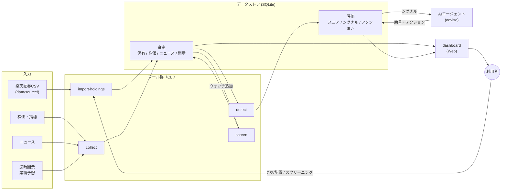

# Design Doc: リポジトリ全体（trading-tools）

| | |
| --- | --- |
| 状態 | **承認**（2026-09-19） |
| 作成日 | 2026-09-19 |
| 対象 | リポジトリ全体。ツール間で共有する目的・方針・データストア・エージェント運用。個別ツールの設計は各ツールの Design Doc に書く |

---

## 1. 背景・課題

資産運用を継続するには、保有銘柄の状態把握と新規候補の監視に、継続的な時間と注意が必要になる。これを怠ると次の失敗が起きる。

- **守りの失敗**: 保有銘柄の状態（悪いニュース、業績予想の下方修正、株価の下落）を把握しておらず、暴落に巻き込まれる
- **攻めの失敗**: 買い時が来ていた銘柄を見過ごす

さらに、変化に気づいたとしても「何をすべきか」が整理されておらず、対応が遅れる・迷う。

現在は楽天証券のアプリを目視で確認しており、監視はすべて人の注意力に依存している。

## 2. 目的

監視をツールに任せ、人は **検知されたものを短時間で確認し、アクションを取るだけ** の状態にする。

> 常時見ている時間をゼロにし、対応する時間だけに絞る。

## 3. ゴール / 非ゴール

### ゴール

- G1. 保有銘柄とウォッチ銘柄について、日次で状態の変化を検知し、スコアとシグナルとして記録する
- G2. 検知結果と「やるべきこと」がダッシュボードにまとまっており、数分で確認できる
- G3. 「やるべきこと」には、事実の羅列（何が起きたか）と、AIによる助言（どう判断すべきか）の両方がある
- G4. 新規候補を探し、ウォッチ銘柄に載せる手段がある
- G5. すべての判断の根拠（その時点の事実と評価）が残り、後から振り返れる

### 非ゴール（意図的にやらないこと）

- 自動売買・発注。判断と執行は人が行う
- ザラ場中のリアルタイム監視。日次で十分とする
- 米国株など日本株以外の市場。設計上は拡張余地を残すが、実装しない
- マルチユーザー・認証。利用者は本人1名、ローカル運用
- 通知（Slack、メール等）。まずはダッシュボードに自分から見に行く。将来の追加は妨げない

## 4. 利用者とシナリオ

利用者は本人1名。

| ID | シナリオ | 頻度 |
| --- | --- | --- |
| U1 | 朝、ダッシュボードを開く。昨日の引け後に検知されたシグナルと、それに対するアクションが並んでいる。要対応のものだけ確認し、対応済みにする | 毎日 |
| U2 | 保有銘柄に悪い業績予想が出た。スコアが下がり「損切りライン接近、売却を検討」というアクションが出ている。銘柄の詳細（ニュース、指標推移）を見て判断する | 随時 |
| U3 | ウォッチ銘柄が下落し、スコア上は割安圏に入った。「買い検討」のアクションが出ている | 随時 |
| U4 | 週末、条件を指定して新規候補を探し、気になる銘柄をウォッチ銘柄に追加する | 週次 |
| U5 | 楽天証券から保有状況のCSVを落とし、取り込む。保有スナップショットが更新される | 取引後 |
| U6 | 過去のアクションと、そのときの事実・助言を振り返る | 月次 |

## 5. 設計方針

| # | 方針 | 理由 |
| --- | --- | --- |
| P1 | **事実と評価を分ける**。外部由来の事実（株価、ニュース、開示）は取得時点付きで保存し、編集しない。評価（スコア、シグナル、助言）は事実から生成し、作り直せる | 再現性と振り返り（G5）。評価ロジックを変えても事実は失われない |
| P2 | **ツールは薄いCLIで、JSONで入出力する** | cron からも Claude Code / codex からも同じように呼べる。エージェントが出力を読んで次の処理に使える |
| P3 | **AIが関わる処理はツールの外に置く**。ツール本体はAIなしで動き、AIはツールの出力を読み、結果をツール経由で書き戻す | AI呼び出しをツールに埋めると、エージェント運用とcron運用で二重実装になる。ツールの決定性とテスト容易性を保つ |
| P4 | **全ツールが1つのデータストア（SQLite）を共有する** | ツール間のデータ受け渡しをファイル経まわりにしない。集計・検索が容易 |
| P5 | **個人データはリポジトリに入れない** | 証券会社CSV等は `data/source/` に置き `.gitignore`。ツールは参照のみで編集・移動・削除しない |
| P6 | **縦に薄く積む**。各マイルストーンは「動いて確認できるもの」を単位にする | エージェント開発では方向のズレを早く検出することが重要 |

## 6. 全体像



### 日次の流れ

1. 引け後、`collect` が保有銘柄・ウォッチ銘柄の株価・ニュース・開示を取得し、事実として保存する（cron または エージェントのスケジューラ）
2. `detect` が事実からスコアを更新し、閾値を超えた変化をシグナルとして記録する。ルールベースのアクション（事実の羅列）もここで作る
3. エージェントが新しいシグナルを読み、助言（どう判断すべきか）をアクションとして書き戻す
4. 利用者は `dashboard` でアクションを確認し、対応済みにする

## 7. リポジトリ構成の当たり

ツール群が同居する前提で、ディレクトリの当たりを示す。確定は M0 の Design Doc で行う。

```
trading-tools/
├── AGENTS.md              # エージェント向け指示（正本）
├── CLAUDE.md              # @AGENTS.md
├── .agents/skills/        # エージェントのスキル（advise など）
├── docs/                  # Design Doc、実行計画
├── tools/                 # CLIツール（import-holdings, collect, detect, screen）
├── apps/dashboard/        # 閲覧用Web
├── packages/              # ツール間で共有するコード（データストア、ドメイン型、CLI規約）
└── data/
    ├── source/            # 個人データ（.gitignore）
    └── trading.db         # SQLite（.gitignore）
```

- 1つの pnpm ワークスペースにし、ツール・アプリ・共有パッケージを分ける
- データストアのスキーマとマイグレーションは `packages/` に置き、全ツールが同じ定義を使う

## 8. ツール群

| ツール | 役割 | 入力 | 出力 | 動かす人 |
| --- | --- | --- | --- | --- |
| `import-holdings` | 楽天証券CSVを保有スナップショットとして取り込む | CSVパス | 保有（事実） | 人 |
| `collect` | 株価・指標・ニュース・開示の取得 | 対象銘柄（保有 + ウォッチ） | 事実 | スケジューラ / エージェント |
| `detect` | スコア計算、シグナル生成、ルールベースのアクション生成 | 事実 | 評価 | スケジューラ / エージェント |
| `advise` | シグナルに対する助言の生成。**エージェントのスキルとして実装**し、ツールは読み書きのCLIだけ提供 | シグナル + 事実 | アクション（AI） | Claude Code / codex |
| `screen` | 条件で新規候補を探す。結果からウォッチ銘柄に追加 | 条件 | 候補一覧、ウォッチ | 人 |
| `dashboard` | アクション一覧、保有・ウォッチ銘柄の状態、銘柄詳細、振り返り | データストア | 画面 | 人 |

`advise` のうち、ニュース本文を読んで良い/悪いを判定する処理もエージェント側に置く（P3）。`detect` はエージェントが付けた判定を入力として使う。

## 9. 主要な概念

ER図・クラス図はここでは書かない。各ツールの Design Doc で、そのツールに必要な分を設計する。

| 概念 | 意味 | 分類 |
| --- | --- | --- |
| 銘柄 (Instrument) | 監視対象の証券。証券コードで一意 | 事実 |
| 保有 (Holding) | ある時点の保有数量・取得単価。CSV取り込みごとにスナップショット | 事実 |
| ウォッチ (Watch) | まだ持っていないが監視する銘柄 | 事実（利用者の意思） |
| 株価 (Quote) | ある時点の価格・出来高 | 事実 |
| 指標 (Fundamentals) | PER / PBR / 配当利回りなど、ある時点の値 | 事実 |
| ニュース (NewsItem) | 銘柄に紐づく記事。見出し・URL・日時 | 事実 |
| 開示 (Disclosure) | 適時開示。決算・業績予想修正など | 事実 |
| 判定 (Assessment) | ニュース・開示1件に対する良い/悪いの判定と強さ。AIが付ける | 評価 |
| スコア (Score) | 銘柄ごとの単一の数値。ある時点の判定・株価変化・指標から算出 | 評価 |
| シグナル (Signal) | スコアや事実の変化が閾値を超えたイベント。「何が起きたか」 | 評価 |
| アクション (Action) | 利用者がやるべきこと。「何をすべきか」。ルール生成とAI生成がある。未対応 / 対応済み / 見送り の状態を持つ | 評価 |

### スコアの考え方

- 銘柄ごとに1つの数値（範囲は実行計画で決める。例: -100 〜 +100）
- 構成要素: 判定（ニュース・開示の ±）、株価変化（下落率・上昇率）、指標（割安・割高）
- 保有銘柄では「守り」（下がったら警告）、ウォッチ銘柄では「攻め」（下がって割安なら買い検討）として、**同じスコアを異なる閾値で読む**
- 重みと閾値は設定として外に出し、調整できるようにする

## 10. 検討した選択肢と決定

| 論点 | 決定 | 却下した選択肢と理由 |
| --- | --- | --- |
| 対象市場 | 日本株のみ | 米国株も: ニュース・開示のデータソースが別系統になり難易度が倍になる。設計上の拡張余地（市場コード）だけ残す |
| データストア | SQLite | JSONファイル群: `cat` で見える透明性はあるが、集計・検索・整合性で不利。CLIがJSONで入出力するので透明性は確保できる |
| 更新頻度 | 日次（引け後） | ザラ場中: データソースの制約が厳しく、非ゴールの「リアルタイム監視」に該当 |
| スコア | 銘柄ごとの単一スコア | 守り用・攻め用の分離: 閾値の読み替えで足りる。2つ持つと整合性の維持が負担 |
| 出力 | ダッシュボード（自分から見に行く） | 通知: まずは不要。後から `detect` の出力を通知に流せる構造にする |
| AIの組み込み方 | エージェントのスキル（ツール外） | ツール内でLLM APIを呼ぶ: cron運用とエージェント運用の二重実装になる。P3 |
| ツールの形態 | CLI + JSON入出力 + Web（閲覧のみ） | すべてWeb: スケジューラ・エージェントから呼びにくい |
| 実装言語 | TypeScript（CLI・Web共通） | Python: データ処理は強いがWebと言語が分かれる。ダッシュボードは TanStack Start |
| AIエージェント | codex / Claude Code の両方 | `AGENTS.md` を正本、`CLAUDE.md` はそれを参照するだけにして乖離を防ぐ |

## 11. データソース候補（未決定）

日本株のデータソースは **実行計画の最初の検証項目** とする。取得可否・利用規約・コストを確認してから決める。

| 種類 | 候補 | 備考 |
| --- | --- | --- |
| 株価・指標 | Yahoo Finance（非公式パッケージ） | 無料、即使える、非公式ゆえ壊れる可能性。`7203.T` 形式 |
| 株価・指標・業績予想 | J-Quants API | JPX公式。無料プランは遅延データ、最新が必要なら有料 |
| 適時開示・業績予想 | TDnet | 公式・無料。APIはなく、ページ構造に依存 |
| 有価証券報告書 | EDINET API | 公式・無料。年次・四半期の詳細財務 |
| ニュース | Google News RSS（銘柄名で検索） | 無料。精度は粗い。見出しとURLのみ |

方針: **最初のマイルストーンはデータソースに依存しない**（CSVの保有データと手入力/モックで流れを通す）。データソースの選定を並行して進め、後のマイルストーンで差し替える。

## 12. AIエージェントとの関係

### 開発時

- エージェント（codex / Claude Code）は `AGENTS.md` から本 Design Doc と実行計画を読み、マイルストーン単位で実装する
- 実装中に見つかった漏れは本書に書き足す。実装済みになった後に設計を変える場合は新しい Design Doc を書き、本書の該当箇所を supersede する

### 運用時

- エージェントは `collect` / `detect` を実行し、シグナルを読み、`advise` スキルで助言を生成してツール経由で書き戻す
- エージェントが直接 SQLite を触らず、必ずCLIを経由する（データ整合性をCLI側で担保）。読み取りも同様

### エージェント向けファイルの配置

codex と Claude Code の両方から同じ内容が見えるように、正本を1つにして参照で共有する。

| 種類 | 正本 | 参照 |
| --- | --- | --- |
| 指示 | `AGENTS.md` | `CLAUDE.md` は `@AGENTS.md` の1行のみ |
| スキル（`advise` など） | `.agents/skills/<name>/SKILL.md` | `.claude/skills` → `.agents/skills` のシンボリックリンク |

`AGENTS.md` には「現在の全体像の要約」「Design Doc と実行計画の場所」「実装前に読むもの」「CLIの規約」を短く書き、詳細は Design Doc に委ねる。

## 13. リスク・未決事項

| # | 内容 | 対応 |
| --- | --- | --- |
| R1 | ニュース・開示の取得元が確保できない、または利用規約上使えない | 最初のマイルストーンで検証。ダメなら「開示のみ（TDnet）」に縮小 |
| R2 | 非公式データソース（Yahoo Finance等）の仕様変更で取得が止まる | 取得失敗を事実として記録し、ダッシュボードで「データが古い」と分かるようにする |
| R3 | AI判定の精度が低く、スコアがノイズになる | 判定に根拠（引用）を残し、人が上書きできるようにする。重みは設定で下げられる |
| R4 | 楽天証券CSVの列形式が変わる | 取り込み時に列を検証し、想定外なら失敗させる |
| R5 | 助言（advise）が投資判断そのものと誤解される | 助言は「判断材料」であり、最終判断は人であることをダッシュボード上で明示 |
| U1 | 楽天証券CSVの正確な列定義 | 実行計画の最初に実物を確認 |
| U2 | スコアの具体的な算出式・重み・閾値 | 実行計画で決め、運用しながら調整 |
| U3 | ウォッチ銘柄の上限、`collect` の対象数（データソースのレート制限に依存） | データソース決定後 |
| U4 | 日次実行の実行環境。手元の Mac の cron / launchd か、Claude Code のスケジューラか。Mac が起動していない日はどう扱うか | M1 で最初は手動実行とし、実行環境は M2 までに決める |
| U5 | 楽天証券CSVの文字コード（Shift_JIS の可能性が高い）と、保有以外に何が取れるか（実現損益、配当など） | U1 と同時に実物で確認 |

## 14. マイルストーンの当たり

詳細は実行計画で決める。ここでは順序と粒度の感覚だけ示す。

| # | 到達点 | 検証できること |
| --- | --- | --- |
| M0 | リポジトリ基盤。`AGENTS.md`、ツール群のディレクトリ構成、データストアの初期化、CLIの共通規約 | エージェントが迷わず着手できる |
| M1 | **守りの最小経路**。CSV取り込み → 株価取得 → 下落検知 → ダッシュボードにアクション表示 | 「検知 → 確認」が一本通る |
| M2 | ニュース・開示の収集と、エージェントによる判定。スコア導入 | 「悪いニュースでスコアが下がる」が動く |
| M3 | `advise`。シグナルに対するAI助言がアクションとして出る | 「何をすべきか」が出る |
| M4 | **攻め**。ウォッチ銘柄、スクリーニング、割安シグナル | 「見過ごし」を減らせる |
| M5 | 振り返り。過去のアクション・事実・助言の時系列表示 | 判断の改善に使える |

M1 の時点でデータソースが未決なら、株価は手入力またはモックで通す。

## 付録 A: シグナルのカタログ（2026-09-19 追記）

価格の上下だけでは「何が起きたか」は分かっても「どう判断するか」に結びつかない。ファンダメンタル（判断の根拠）とテクニカル（タイミングと異変の検知）を組み合わせる。
**シグナルは必ず「これが出たら何を判断するか」とセットで定義する。** 判断に結びつかない指標（RSI、MACD 等の短期売買向け）は入れない。

| kind | 種類 | 定義（既定の閾値） | 出たら何を判断するか | データ要件 | 段階 |
| --- | --- | --- | --- | --- | --- |
| `price_drop_cost` | 価格 | 株価が平均取得単価比 -10%（warn）/ -20%（critical） | 損失が膨らんでいる。持つ理由を再確認する | 保有、株価 | M1 |
| `drawdown_60d` | テクニカル | 直近 60 営業日の高値から -15% / -25% | 高値から崩れた、またはじわじわ下がっている。理由を調べる | 株価履歴 | M1 |
| `below_ma200` | テクニカル | 終値が 200 日移動平均を下回った（上から下へ抜けた日） | 相場の長期的な評価が変わった。理由を調べる | 株価履歴 200 日 | M1 |
| `price_drop_day` | 価格 | 前日比 -7% | 急変。ニュース・開示を確認する | 株価 | M1 |
| `forecast_down` | ファンダ | 業績予想の下方修正（開示） | 持つ理由が崩れていないか。売却を検討 | 適時開示 | M2 |
| `dividend_cut` | ファンダ | 減配・無配の発表 | 同上 | 適時開示 | M2 |
| `margin_deterioration` | ファンダ | 営業利益率が前年同期比で悪化（閾値は M2 で決める） | 収益性の低下。持つ理由を再確認 | 四半期決算 | M2 |
| `equity_ratio_drop` | ファンダ | 自己資本比率の低下（閾値は M2 で決める） | 財務健全性の低下 | 四半期決算 | M2 |
| `news_negative` | ファンダ | AI 判定で悪材料と評価されたニュース | 内容を確認し、売却の要否を判断 | ニュース、AI 判定 | M2 |
| `valuation_cheap` | ファンダ（攻め） | PER / PBR が過去 3 年のレンジの下位、かつ配当利回りが閾値超え | 割安。買いを検討 | 指標の履歴 | M4 |
| `growth_streak` | ファンダ（攻め） | 増収増益が N 期連続 | 質が良い。買い候補 | 四半期決算 | M4 |
| `oversold_quality` | テクニカル + ファンダ（攻め） | 200 日線より下、かつ `valuation_cheap` | 良い銘柄が売られすぎ。買い時の候補 | 株価履歴、指標 | M4 |

- 閾値はすべて `config/detect.json` に置き、運用しながら調整する
- 四半期決算データ（売上、営業利益、自己資本比率など）は本文 §11 のデータソース候補に無かった。S1 の検証項目に加える（J-Quants が本命）
- 単一スコア（§9）の構成要素はこのカタログの kind から作る。重みは M2 で決める
