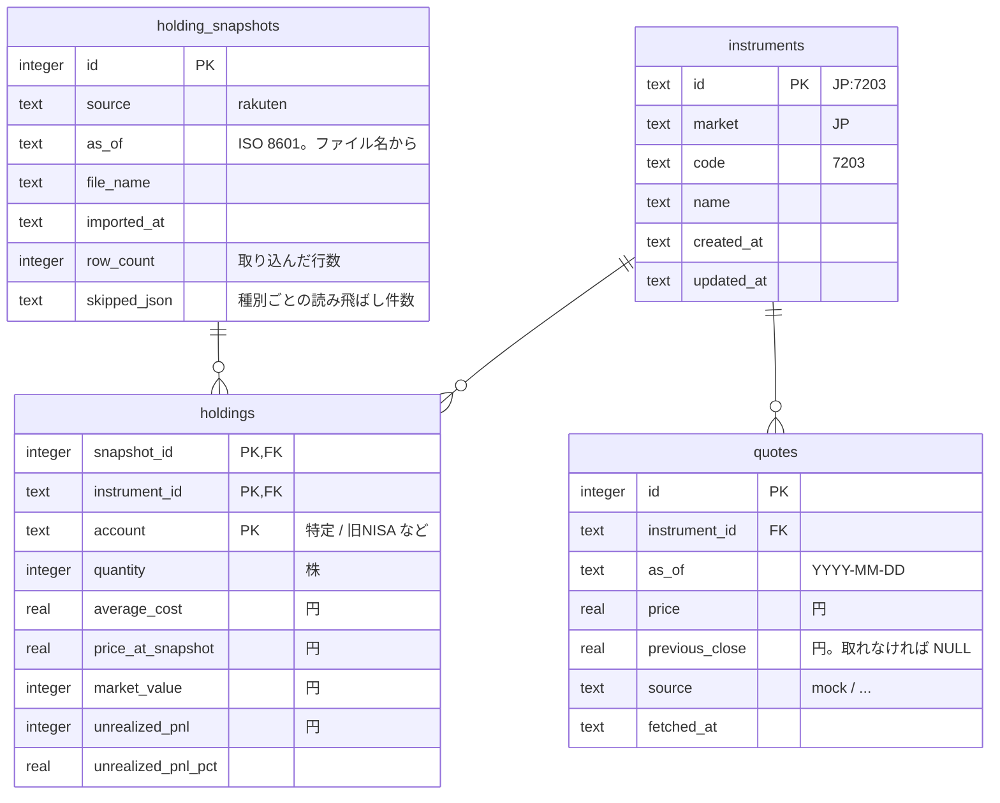

# Design Doc 0003: 保有の取り込みと株価の収集（M1 入力側）

| | |
| --- | --- |
| 状態 | 草案（壁打ち中） |
| 作成日 | 2026-09-19 |
| 元になる Design Doc | [0001](./0001-repository.md) §8 ツール群、[0002](./0002-foundation.md) §3.3 CLI 規約 |
| 対応するマイルストーン | [実行計画 0001](../execution-plans/0001-initial.md) M1 |
| 対になる Design Doc | 0004（出力側: `detect` と `dashboard`） |

## 1. 背景と目的

M1「守りの最小経路」の入力側。楽天証券の CSV から保有銘柄を取り込み、その銘柄の株価を日次で保存する。ここで作る **銘柄・保有・株価** の3つの事実が、0004 の検知とダッシュボードの入力になる。

## 2. スコープ / 非スコープ

### スコープ

- `import-holdings`: 楽天証券の「保有商品詳細」CSV を保有スナップショットとして取り込む
- `collect quotes`: 保有銘柄の株価を取得して保存する。取得元は Provider で差し替え可能とし、M1 は **モック Provider** で通す
- テーブル: `instruments`, `holding_snapshots`, `holdings`, `quotes`

### 非スコープ

- 国内株式以外（投資信託・米国株式）の監視。取り込み時に件数だけ記録して読み飛ばす（§3.2）
- ニュース・開示・指標（PER 等）の収集（M2）
- ウォッチ銘柄（M4）
- 実データの Provider（S1 の結果で 0005 に書く）

## 3. 設計

### 3.1 楽天証券 CSV の形式（実物で確認）

| 項目 | 内容 |
| --- | --- |
| ファイル名 | `assetbalance(all)_YYYYMMDD_HHMMSS.csv`。この日時をスナップショットの `as_of` にする |
| 文字コード | CP932（Shift_JIS）。改行 CRLF |
| 構成 | 3セクション。`■資産合計欄` → `■ 保有商品詳細 (すべて）` → `■参考為替レート`。セクション見出しは1列だけの行、間に空行 |
| 使う部分 | `■ 保有商品詳細` のみ。見出し行の次の行がヘッダ、以降空行までがデータ |

保有商品詳細のヘッダ（18列）:

| # | 列名 | 使い方 |
| --- | --- | --- |
| 0 | 種別 | `国内株式` のみ取り込む。それ以外は読み飛ばし件数に計上 |
| 1 | 銘柄コード・ティッカー | 4桁の証券コード。`instruments.code` |
| 2 | 銘柄 | `instruments.name` |
| 3 | 口座 | `特定` / `一般` / `旧NISA` / `NISA成長投資枠` / `NISAつみたて投資枠`。`holdings.account` |
| 4 | 保有数量 | `holdings.quantity`。カンマ区切り整数 |
| 5 | ［単位］ | `株` を期待。違えば失敗 |
| 6 | 平均取得価額 | `holdings.average_cost`。小数あり |
| 7 | ［単位］ | `円` を期待 |
| 8 | 現在値 | `holdings.price_at_snapshot`。CSV 出力時点の株価 |
| 9 | ［単位］ | `円` を期待 |
| 10 | 現在値(更新日) | 空だった。使わない |
| 11 | (参考為替) | 使わない |
| 12 | 前日比 | 使わない（quotes から計算する） |
| 13 | ［単位］ | 使わない |
| 14 | 時価評価額[円] | `holdings.market_value` |
| 15 | 時価評価額[外貨] | 使わない |
| 16 | 評価損益[円] | `holdings.unrealized_pnl` |
| 17 | 評価損益[％] | `holdings.unrealized_pnl_pct` |

数値の書式: カンマ区切り、`+` / `-` の符号付きあり、小数点以下の桁数は列・銘柄により異なる。パース時にカンマと符号を処理する。

### 3.2 取り込みの振る舞い（`import-holdings`）

```
pnpm import-holdings run <csv-path> [--replace]
pnpm import-holdings list
```

- `run`: CSV を読み、1回の取り込みを1つの **スナップショット** として保存する
  1. ファイル名から `as_of` を得る。得られなければ失敗（`code: bad_filename`）
  2. CP932 でデコードし、`■ 保有商品詳細` セクションを探す。見つからない、またはヘッダが想定と違えば失敗（`code: unexpected_format`。想定と実際のヘッダを `details` に入れる）
  3. `種別 = 国内株式` の行だけを対象にし、それ以外は種別ごとの件数を `skipped` に記録する
  4. 銘柄が `instruments` になければ作る。あれば `name` を更新する
  5. `holding_snapshots` に1行、`holdings` に対象行数分を **1トランザクション**で書く
- **冪等性**: `holding_snapshots` は `(source, as_of)` で一意。同じファイルを再度取り込むと `code: already_imported` で失敗する。`--replace` を付けたときだけ、そのスナップショットを消してから入れ直す
- `--dry-run`: 何も書かず、取り込む予定の件数と `skipped` を返す
- 出力例:

```json
{"ok":true,"data":{"snapshotId":3,"asOf":"2026-07-18T01:02:58+09:00","imported":27,"skipped":{"投資信託":19,"米国株式":6},"instrumentsCreated":2}}
```

- `list`: スナップショットの一覧（`id`, `as_of`, `imported_at`, `row_count`）

### 3.3 株価の収集（`collect quotes`）

```
pnpm collect quotes [--provider <name>] [--as-of YYYY-MM-DD]
```

- 対象銘柄: **最新のスナップショットに含まれる銘柄**。M4 でウォッチ銘柄が加わる
- `--as-of` 省略時は実行日（`Asia/Tokyo`）。日次の引け値を保存する想定なので、時刻は持たない
- Provider は `--provider` > 環境変数 `TRADING_QUOTE_PROVIDER` > 既定 `mock` の順で選ぶ
- **冪等性**: `quotes` は `(instrument_id, as_of, source)` で一意。同じ日に再実行したら上書きする（同じ日の引け値の再取得は同じ事実の更新とみなす。`fetched_at` を更新する）
- 一部の銘柄で取得に失敗しても、取れた分は保存し、失敗は `failed` に銘柄と理由を入れて **`ok: true`** で返す。全件失敗のときだけ `ok: false`（`code: all_failed`）
- 出力例:

```json
{"ok":true,"data":{"asOf":"2026-09-19","provider":"mock","fetched":25,"failed":[{"code":"7203","reason":"not in mock data"}]}}
```

#### Provider インターフェース

```ts
interface QuoteProvider {
  readonly name: string
  fetchQuotes(codes: string[], asOf: string): Promise<QuoteResult[]>
}
type QuoteResult =
  | { code: string; ok: true; price: number; previousClose?: number }
  | { code: string; ok: false; reason: string }
```

`packages/market-data` に置き、`collect` から使う。0005（データソース選定）で実データの Provider を追加する。

#### モック Provider

`data/source/mock-quotes.json` を読む。ファイルは利用者が手で編集する。

```json
{ "7203": { "price": 2500, "previousClose": 2600 }, "9984": { "price": 7000 } }
```

- ファイルにない銘柄は失敗（`reason: "not in mock data"`）
- ファイルがなければ、**最新スナップショットの `price_at_snapshot`** を初期値としてファイルを生成し、それを返す（最初の1回で「今の株価」が入った状態になる）。以降は利用者が値を書き換えて「下落した状態」を作れる。0004 の完了の定義「株価を下落させた状態で detect を実行」はこれで行う

### 3.4 テーブル



- 一意制約: `holding_snapshots (source, as_of)`、`quotes (instrument_id, as_of, source)`
- 索引: `quotes (instrument_id, as_of desc)`
- `instruments.id` は `市場:コード`（0001 の拡張余地。M1 は `JP` のみ）
- 金額の型（0002 の U1）: **数量は整数、単価は実数（円、小数あり）、金額は整数（円）**。SQLite の `real` は倍精度。円単位の集計で誤差が問題になる規模ではない
- 日時はすべて文字列（ISO 8601、`+09:00`）。日付は `YYYY-MM-DD`
- 同じ銘柄を複数の口座で持てるため、`holdings` の主キーに `account` を含める

### 3.5 パッケージ構成

| パス | 内容 |
| --- | --- |
| `packages/db/src/schema/{instruments,holding-snapshots,holdings,quotes}.ts` | テーブル定義 |
| `packages/market-data/` | `QuoteProvider` と `mock` Provider。以降の Provider もここ |
| `tools/import-holdings/` | CSV パーサ（`rakuten.ts`）と `run` / `list` |
| `tools/collect/` | `quotes` サブコマンド。M2 で `news` / `disclosures` を追加 |

CSV パーサは純粋関数（文字列 → 行の配列）にして、実物に似せた **匿名のフィクスチャ** でテストする。フィクスチャは架空の銘柄・数量で作り、実物の CSV はテストに使わない。

## 4. 検討した選択肢と決定

| 論点 | 決定 | 却下した選択肢と理由 |
| --- | --- | --- |
| 投資信託・米国株式の扱い | 読み飛ばして件数だけ記録 | 全部取り込む: 0001 で日本株のみと決めた。投資信託は銘柄コードがなく `instruments` の設計が変わる。将来やるなら別の Design Doc |
| 同じファイルの再取り込み | 失敗させ、`--replace` で入れ直し | 黙って上書き: 誤操作に気づけない。黙ってスキップ: 「取り込んだつもり」が起きる |
| `as_of` の出どころ | ファイル名 | 取り込み時刻: ダウンロードから取り込みまで日が空くと事実の時点がずれる |
| 株価の同日再取得 | 上書き | 履歴として追加: 同じ日の引け値が複数あると「その日の株価」が一意に決まらない。0001 P1 の「事実は編集しない」は、時点が違う事実を区別することが目的で、同じ時点の再取得は矛盾しない |
| 一部失敗時の扱い | 取れた分を保存して `ok: true`、`failed` に列挙 | 全体を失敗にする: 1銘柄の不調で全銘柄の株価が止まる |
| モックの実現 | JSON ファイルを人が編集 | `--input` で毎回渡す: 日次で毎回渡すのは手間。固定値: 「下落した状態」を作れない |
| CSV の `現在値` を株価として使う | `holdings.price_at_snapshot` に保存するが `quotes` には入れない | quotes に入れる: 取り込みのたびに株価が入るのは便利だが、取得元が混ざる。モックの初期値として使うにとどめる |

## 5. リスク・未決事項

| # | 内容 | 対応 |
| --- | --- | --- |
| R1 | 楽天証券が CSV の列を変える | ヘッダを完全一致で検証し、違えば `unexpected_format` で止める。実物との差分が `details` に出る |
| R2 | ファイル名の形式が変わり `as_of` が取れない | `bad_filename` で止める。`--as-of` で明示できるようにするかは 0004 以降で判断 |
| R3 | 空欄・`-` などの想定外の値 | フィクスチャに含めてテストする。パースできなければ行番号つきで失敗 |
| U1 | セクション見出し `■ 保有商品詳細 (すべて）` の括弧が全角・半角混在。表記揺れがあり得る | 前方一致（`■ 保有商品詳細` で始まる）で探す |

## 要確認

1. 投資信託・米国株式を読み飛ばす判断でよいか（時価評価額の合計は出せなくなる。M1 では不要と考えている）
2. モック株価を「JSON ファイルを人が編集」で作る方式でよいか
3. `collect quotes` を M2 で `collect news` などと同じツールに置く前提でよいか（1ツール複数サブコマンド）
