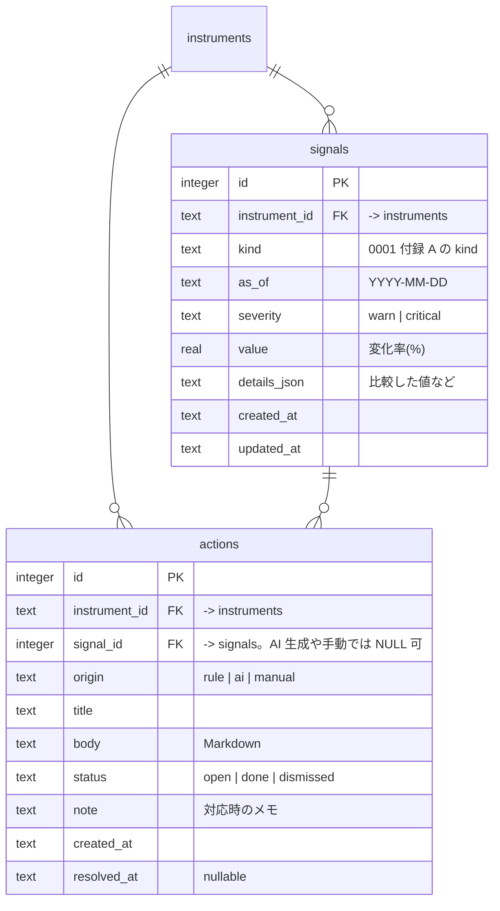
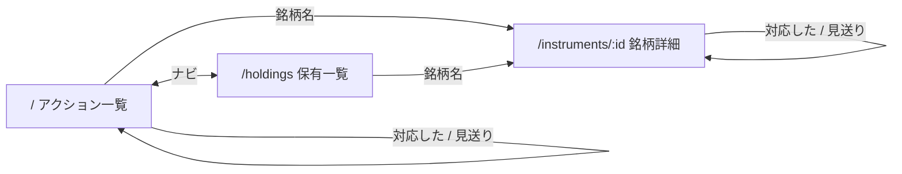

# Design Doc 0005: 下落の検知とダッシュボード（M1 出力側）

| | |
| --- | --- |
| 状態 | 草案（壁打ち中） |
| 作成日 | 2026-09-19 |
| 元になる Design Doc | [0001](./0001-repository.md) §8 ツール群・§9 主要な概念、[0003](./0003-holdings-and-quotes.md)（入力側） |
| 対応するマイルストーン | [実行計画 0001](../execution-plans/0001-initial.md) M1 |

## 1. 背景と目的

M1「守りの最小経路」の出力側。0003 で保存した保有と株価から **下落を検知してシグナルとアクションを作り**、それを **ダッシュボードで確認して対応済みにできる** ところまでを通す。これで「検知 → 確認」が一本つながる。

## 2. スコープ / 非スコープ

### スコープ

- `detect run`: 株価の下落をルールで検知し、シグナルとルール生成のアクションを作る
- `actions list` / `actions resolve`: アクションの一覧と状態変更（CLI。エージェントと人の両方が使う）
- テーブル: `signals`, `actions`
- `apps/dashboard`: アクション一覧（未対応 / 対応済み / 見送り）、保有銘柄一覧、銘柄詳細。アクションの状態変更
- 閾値の設定ファイル

### 非スコープ

- スコア、ニュース・開示に基づくシグナル（M2）
- AI 助言（M3）。ただし `actions` テーブルは AI 生成のアクションも入る設計にしておく
- ウォッチ銘柄、割安シグナル（M4）
- 株価チャート、通知

## 3. 設計

### 3.1 検知ルール（`detect run`）

```
pnpm detect run [--as-of YYYY-MM-DD]
```

対象は最新スナップショットの保有銘柄（0003 の `holdingTargets` と同じ）。`as_of` の株価と `quotes` の履歴を使い、[0001 付録 A](./0001-repository.md#付録-a-シグナルのカタログ2026-09-19-追記) の M1 の4ルールを評価する。ファンダメンタル系は M2 以降（データがまだ無い）。

| kind | 何を比べるか | 既定の閾値 | 履歴が足りないとき |
| --- | --- | --- | --- |
| `price_drop_cost` | `as_of` の株価 vs 平均取得単価（口座横断の数量加重平均） | -10% warn / -20% critical | — |
| `drawdown_60d` | `as_of` の株価 vs 直近 60 営業日（`quotes` の直近 60 行）の高値 | -15% warn / -25% critical | 20 行未満なら評価しない |
| `below_ma200` | `as_of` の株価 vs 200 日移動平均。**上から下へ抜けた日**だけ（前日は平均以上、当日は未満） | 抜けたら warn | 200 行未満なら評価しない |
| `price_drop_day` | `as_of` の株価 vs 前営業日の株価（`quotes` で `as_of` より前の直近。なければ `previous_close`） | -7% warn | 前日の値がなければ評価しない |

- 評価しなかった銘柄・ルールは `skipped` に理由を入れて返す
- 閾値を超えたら **シグナル** を1つ作る。同じ `(instrument_id, kind, as_of)` があれば上書き（値と重大度を更新）。同じ日に何度実行しても増えない。シグナルは「その日、その条件が成立した」記録であり、条件が続く限り毎日作られる（M5 の時系列表示に使う）
- 閾値を下回らなくなった日は、その日のシグナルは作らない。過去のシグナルは消さない

#### アクションの生成（重複の抑制）

シグナルが毎日作られてもアクションが毎日増えないよう、次の規則で **ルール生成のアクション** を作る。

1. 同じ銘柄・同じ kind の **未対応（`open`）** のアクションがあれば作らない
2. 直近のアクション（`done` / `dismissed`）より **重大度が上がった** ときは作る
3. 直近のアクションから **`reissue_after_days`（既定 30 日）** 以上経っていれば作る
4. それ以外は作らない

これで「取得単価比 -12% が 2 週間続く」は最初の 1 件だけになり、-20% に悪化したときにもう 1 件出る。

- 出力例:

```json
{"ok":true,"data":{"asOf":"2026-09-19","evaluated":25,"skipped":[{"code":"1234","kind":"below_ma200","reason":"insufficient history (12 < 200)"}],"signals":{"created":2,"updated":0},"actions":{"created":1,"suppressed":1}}}
```

#### 閾値の設定

`config/detect.json` にコミットする（個人データではない）。無ければ既定値。

```json
{
  "price_drop_cost": { "warn": -10, "critical": -20 },
  "drawdown_60d": { "warn": -15, "critical": -25, "window": 60, "minHistory": 20 },
  "below_ma200": { "window": 200 },
  "price_drop_day": { "warn": -7 },
  "reissue_after_days": 30
}
```

M2 でファンダ系の閾値とスコアの重みもここに入る。

### 3.2 シグナルとアクションのテーブル



- 一意制約: `signals (instrument_id, kind, as_of)`、`actions (signal_id, origin)`（`signal_id` が NULL の行は制約の対象外）
- 索引: `actions (status, created_at desc)`、`actions (instrument_id, created_at desc)`、`signals (instrument_id, as_of desc)`
- **シグナル = 何が起きたか（事実の解釈）、アクション = 何をすべきか**（0001 §9）。M1 のルール生成アクションは「事実の羅列」（0001 の 2-a）で、判断は含めない
- `status`: `open`（未対応）→ `done`（対応した）/ `dismissed`（見送り）。`done` / `dismissed` から `open` に戻せる（誤操作の取り消し）

### 3.3 ルール生成アクションの文面

すべて「事実の羅列」で、判断は含めない。末尾に「売る / 持つの判断は人が行う」と明記する。

| kind | title | body |
| --- | --- | --- |
| `price_drop_cost` | `{銘柄名}: 取得単価比 {value}%` | 平均取得単価、当日の株価、保有数量、含み損の額 |
| `drawdown_60d` | `{銘柄名}: 直近高値から {value}%` | 高値とその日付、当日の株価、取得単価比 |
| `below_ma200` | `{銘柄名}: 200 日線を下回った` | 200 日平均、当日の株価、直近 60 日の高値からの下落率 |
| `price_drop_day` | `{銘柄名}: 前日比 {value}%` | 前日と当日の株価、評価額の変化。「ニュース・開示を確認」と促す |

### 3.4 `actions` コマンド

```
pnpm actions list [--status open|done|dismissed|all]   # 既定 open
pnpm actions resolve <id> --status done|dismissed|open [--note "..."]
```

- ダッシュボードの状態変更と同じ処理を CLI からも行える。エージェント（M3 の `advise`）はこの CLI でアクションを作る・読む（M3 で `actions create` を足す）
- `resolve` は `resolved_at` を更新する。`open` に戻すときは `resolved_at` を NULL にする

### 3.5 ダッシュボード（`apps/dashboard`）

TanStack Start（React、SSR）。サーバー側で `@trading/db` を直接読む（ダッシュボードはツールの一員であり、0001 の「CLI 経由」制約はエージェントに対するもの）。書き込みは **アクションの状態変更のみ** で、`actions resolve` と同じ関数を共有する。

| パス | 画面 | 内容 |
| --- | --- | --- |
| `/` | アクション一覧 | 未対応のアクションを重大度・日付順に。各行に銘柄名、title、シグナルの値、「対応した」「見送り」ボタン。タブで 対応済み / 見送り も見られる。ヘッダに「株価の最終取得日」を出し、古ければ警告（0001 R2） |
| `/holdings` | 保有一覧 | 最新スナップショットの銘柄ごとに、数量、平均取得単価、最新株価、前日比、取得単価比、評価損益。下落中の行を強調 |
| `/instruments/:id` | 銘柄詳細 | 保有（口座別）、直近の株価（表、30日分）、この銘柄のシグナルとアクションの履歴 |

- 見た目は最小限（素の CSS）。デザインは M5 の振り返り画面と合わせて後で整える
- 認証なし、`localhost` のみで起動する（0001 非ゴール）
- 起動: `pnpm dashboard`（`vite dev`）。ビルド・デプロイは M1 では扱わない

#### 画面遷移



### 3.6 パッケージ構成

| パス | 内容 |
| --- | --- |
| `packages/db/src/schema/{signals,actions}.ts` | テーブル |
| `packages/domain/` | **新設**。ツールとダッシュボードが共有する読み書き（保有対象の取得、最新株価、アクションの状態変更）。0003 の `holdingTargets` もここへ移す |
| `tools/detect/` | ルール評価と `run` |
| `tools/actions/` | `list` / `resolve` |
| `apps/dashboard/` | TanStack Start |
| `config/detect.json` | 閾値 |

## 4. 検討した選択肢と決定

| 論点 | 決定 | 却下した選択肢と理由 |
| --- | --- | --- |
| ルールの選定 | 0001 付録 A の M1 分（価格 2 + テクニカル 2） | 前日比だけ: 相場全体の下げ日に一斉に鳴り、じわじわ下がる銘柄を拾えない（壁打ちで指摘）。RSI 等の短期指標: 長期投資の判断に結びつかない |
| 検知ルールの置き場 | `detect` ツール（コード）+ 閾値だけ設定ファイル | ルール全体を設定ファイルで記述: M1 の4ルールには過剰。M2 でスコアが入るときに再考 |
| アクションの重複抑制 | 未対応があれば作らない + 重大度上昇 + 30 日で再発行 | シグナルごとに毎日作る: 条件が続く限り毎日増えて見なくなる。1銘柄1件だけ: 悪化したことに気づけない |
| 前日比の「前日」 | `quotes` の直近前日、なければ `previous_close` | `previous_close` のみ: モックでは省略されることが多い。`quotes` のみ: 初日に何も検知できない |
| 取得単価の口座またぎ | 数量加重平均 | 口座ごとにシグナル: 同じ銘柄で複数のアクションが出て煩い。口座別は銘柄詳細で見られる |
| 同日再実行 | シグナルは上書き、アクションは重複抑制の規則に従う | 両方作り直す: 人が付けた `done` が消える |
| アクションの状態変更の入口 | CLI とダッシュボードの両方（同じ関数） | ダッシュボードのみ: エージェントが状態を読めない・変えられない |
| `actions` を独立ツールにする | する | `detect` に同居: 「検知」と「対応の記録」は別の責務。M3 で `advise` が使うのは後者だけ |
| ダッシュボードの DB アクセス | `@trading/db` を直接 | CLI を子プロセスで呼ぶ: 遅く、画面ごとに JSON を組み立て直すことになる |
| 共有コードの置き場 | `packages/domain` を新設 | ツール同士で import: `tools/collect` から `tools/detect` への依存は方向が不自然 |

## 5. リスク・未決事項

| # | 内容 | 対応 |
| --- | --- | --- |
| R1 | TanStack Start の API 変化が速い（`createServerFn` の `validator` → `inputValidator` など） | バージョンを固定し、公式の最小構成に寄せる。凝った機能を使わない |
| R2 | 営業日の扱い。土日に `detect run` すると「前日」が金曜で問題ないが、祝日を挟むと `quotes` に穴ができる | 「`as_of` より前の直近の quote」で比較するので穴は自然に飛ばされる。祝日カレンダーは持たない |
| R3 | モックで試すには複数日分の quote が要る（`below_ma200` は 200 日分） | `collect quotes --as-of` で任意の日付を入れられる（0003）。`below_ma200` はテストで検証し、手元では実データが溜まるのを待つ |
| R4 | 実データが溜まるまで `drawdown_60d` / `below_ma200` は動かない | S1 でヒストリカルデータを一括取得できる Provider を選ぶ（過去 1 年分の日足） |
| U1 | ダッシュボードの `/holdings` を M1 に含めるか（M1 の完了の定義には不要） | 含める案にしている。要確認 |

## 要確認

1. 4ルールの閾値の既定値はこれでよいか（運用しながら `config/detect.json` で調整する前提）
2. アクションの重複抑制（未対応があれば作らない / 重大度上昇 / 30 日で再発行）でよいか
3. `/holdings`（保有一覧）を M1 に含めてよいか
4. `actions` を独立ツールにする判断でよいか
