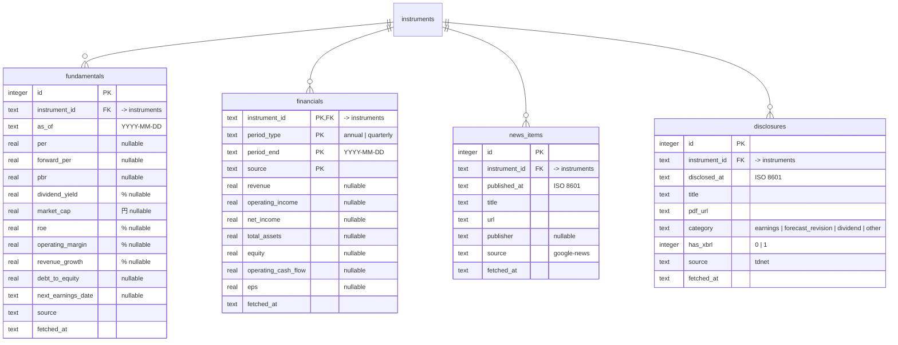

# Design Doc 0010: 実データの収集（M2 前半）

| | |
| --- | --- |
| 状態 | 承認（2026-09-20） |
| 作成日 | 2026-09-20 |
| 元になる Design Doc | [0009](./0009-data-sources.md)（データソース）、[0003](./0003-holdings-and-quotes.md)（`collect` と Provider）、[0005](./0005-detect-and-dashboard.md)（`detect` と銘柄詳細） |
| supersede | 0003 §3.3 のうち Provider の既定（`mock` → `yahoo`）、0005 §3.1 のうち `detect run` の `as_of` の既定 |
| 対応するマイルストーン | [実行計画 0001](../execution-plans/0001-initial.md) M2 |

## 1. 背景と目的

M1 は株価をモックで通した。0009 で決めた取得元を実装し、**株価・日足・指標・年次財務・ニュース・適時開示** を日次で保存する。ここで貯まる事実が、後半（0011: 判定とスコア）の入力になる。

## 2. スコープ / 非スコープ

### スコープ

- Provider の実装: `yahoo`（株価・日足・指標・年次財務）、`google-news`（ニュース）、`tdnet`（適時開示）
- `collect` のサブコマンド追加: `fundamentals` / `financials` / `news` / `disclosures` / `all`。`quotes` に日足の遡り取得を追加
- テーブル: `fundamentals`, `financials`, `news_items`, `disclosures`
- 銘柄詳細（ダッシュボード）にニュースと開示の一覧を表示
- `detect run` の `as_of` の既定を「今日」から「株価の最新日」に変更（休日の実行で `no quote` にならないように）

### 非スコープ

- ニュース・開示の良し悪しの判定、PDF 本文の読み取り、スコア（0011）
- ウォッチ銘柄（M4）。対象は引き続き最新スナップショットの保有銘柄
- 日次実行の自動化（0011 で U4 と一緒に決める）

## 3. 設計

### 3.1 Provider

`packages/market-data` に種類ごとのインターフェースを置き、Provider がそれを実装する。

```ts
interface QuoteProvider {           // 0003 の拡張
  name: string
  fetchQuotes(codes: string[]): Promise<QuoteResult[]>        // asOf を返すように変更
  fetchHistory(code: string, from: string): Promise<Bar[]>     // 日足。from は YYYY-MM-DD
}
interface FundamentalsProvider { fetchFundamentals(codes: string[]): Promise<FundamentalsResult[]> }
interface FinancialsProvider   { fetchFinancials(code: string): Promise<FinancialsResult> }   // 年次
interface NewsProvider         { fetchNews(query: string): Promise<NewsItem[]> }
interface DisclosureProvider   { fetchDisclosures(date: string): Promise<Disclosure[]> }      // その日の全件
```

| Provider | 実装 | 備考 |
| --- | --- | --- |
| `yahoo` | Quote / Fundamentals / Financials | `yahoo-finance2`。シンボルは `<code>.T`。リクエストは直列で 200ms 空ける。`fetchQuotes` の `asOf` は `regularMarketTime` を JST の日付にしたもの（休日は直近の営業日になる） |
| `google-news` | News | RSS。`query` は銘柄名を NFKC 正規化（全角英数 → 半角）し、`株式会社` / `（株）` を除いたもの |
| `tdnet` | Disclosure | 日付の一覧ページ（最大 3 ページ）を取り、全件を返す。`collect` 側で保有銘柄に絞る。コードは 5 桁の先頭 4 桁で照合 |
| `mock` | Quote | 既存。テストと手元の検証用に残す |

Provider の選択: `TRADING_QUOTE_PROVIDER` の **既定を `yahoo` に変更**（0003 を supersede）。News / Disclosure は既定のみ（切り替えはテストでの注入で足りる）。

### 3.2 `collect` のサブコマンド

| コマンド | 対象 | 保存先 | 冪等性のキー | 頻度の目安 |
| --- | --- | --- | --- | --- |
| `quotes` | 保有銘柄 | `quotes` | `(instrument_id, as_of, source)` 上書き | 日次 |
| `quotes --backfill [<from>]` | 同上 | `quotes` | 同上。`from` 省略時は 1 年前 | 初回、銘柄追加時 |
| `fundamentals` | 保有銘柄 | `fundamentals` | `(instrument_id, as_of, source)` 上書き | 日次 |
| `financials` | 保有銘柄 | `financials` | `(instrument_id, period_type, period_end, source)` 上書き | 週次で十分（`all` では実行する） |
| `news` | 保有銘柄 | `news_items` | `(instrument_id, url)` 既存なら無視 | 日次 |
| `disclosures [--date <date>]` | その日の TDnet 全件 → 保有銘柄 | `disclosures` | `(instrument_id, pdf_url)` 既存なら無視 | 日次。既定は今日と前日の 2 日分（夜に実行する前提） |
| `all` | 上のすべて | | | 日次。1 つが失敗しても他は続け、結果をまとめて返す |

- `quotes` は **株価が 1 件もない銘柄を自動で遡り取得する**（新しく保有した銘柄が翌日から `drawdown_60d` / `below_ma200` の対象になる）
- 一部失敗の扱いは 0003 と同じ（取れた分は保存、`failed` に列挙、全件失敗だけ `ok: false`）
- 出力例（`all`）:

```json
{"ok":true,"data":{"quotes":{"asOf":"2026-09-18","fetched":27,"failed":[]},"fundamentals":{"fetched":27,"failed":[]},"financials":{"fetched":24,"failed":[{"code":"3656","reason":"no annual data"}]},"news":{"fetched":27,"inserted":41},"disclosures":{"dates":["2026-09-19","2026-09-20"],"scanned":512,"inserted":2}}}
```

### 3.3 テーブル



- 一意制約: `fundamentals (instrument_id, as_of, source)`、`news_items (instrument_id, url)`、`disclosures (instrument_id, pdf_url)`
- `disclosures.category` は表題のキーワードで機械的に付ける（`決算短信` → `earnings`、`業績予想` + `修正` → `forecast_revision`、`配当` → `dividend`、それ以外 `other`）。上方 / 下方の向きは付けない（0011 で AI が読む）
- 比率（`dividend_yield`, `roe`, `operating_margin`, `revenue_growth`）は **% の値** で保存する（Yahoo は 0.033 のような小数で返すので 100 倍する）。`quotes.price` などと同じく `real`
- `financials` は年次を保存する。四半期も取れた銘柄は `period_type = quarterly` で保存してよいが、シグナルは年次だけを使う（0009）
- ニュース・開示は消さない（事実）。件数は 1 銘柄 1 日あたり数件で、肥大化しない

### 3.4 `detect run` の `as_of` の既定（0005 を supersede）

実データでは株価の日付は **直近の営業日**（土日祝に実行すると金曜）になる。`--as-of` 省略時の既定を「今日」から「`quotes` の最新の `as_of`」に変える。指定した場合はその日を使う（従来どおり）。

### 3.5 ダッシュボード（銘柄詳細）

`pages/instrument` に **ニュース（直近 20 件）** と **開示（直近 20 件）** の表を追加する。widgets: `news-list`、`disclosure-list`。ニュースは見出し（外部リンク）・日時・媒体、開示は日時・種別バッジ・表題（PDF リンク）。判定やスコアの表示は 0011。

### 3.6 パッケージ構成

| パス | 内容 |
| --- | --- |
| `packages/market-data/src/{yahoo,google-news,tdnet}.ts` | Provider |
| `packages/market-data/src/provider.ts` | 5 つのインターフェースと結果の型 |
| `packages/db/src/schema/{fundamentals,financials,news-items,disclosures}.ts` | テーブル |
| `packages/domain/src/{news,disclosures,fundamentals}.ts` | 読み取り（ダッシュボードと 0011 が使う） |
| `tools/collect/src/{fundamentals,financials,news,disclosures,all}.ts` | サブコマンド |
| `apps/dashboard/src/widgets/{news-list,disclosure-list}` | 表示 |

Provider のテストは **記録済みのレスポンス（フィクスチャ）** に対して行い、テスト中に外部へアクセスしない。フィクスチャは架空の銘柄に書き換えた最小限のものにする。

## 4. 検討した選択肢と決定

| 論点 | 決定 | 却下した選択肢と理由 |
| --- | --- | --- |
| 日足の遡り | `collect quotes` が株価 0 件の銘柄を自動で 1 年分取る | 常に全銘柄を遡る: 毎日 27 リクエストが無駄。手動の `--backfill` だけ: 銘柄を追加したときに忘れる |
| `asOf` の出どころ | Provider が返す（Yahoo の `regularMarketTime`） | 実行日: 休日に実行すると「今日の株価」として金曜の値が入り、日付がずれる |
| ニュースの検索語 | 正規化した銘柄名だけ | 証券コードを足す: 0009 の検証で精度が上がらなかった。業種語を足す: 銘柄ごとの調整が要り、自動化できない |
| 開示の絞り込み | 全件を取って `collect` 側で絞る | 銘柄ごとの検索: TDnet に銘柄検索の安定した URL が無い。全件でも 1 日 3 リクエスト |
| 開示の向き（上方 / 下方） | 0010 では付けない | 表題から推定: 表題に無いことが多い（0009）。PDF を読むのは AI の仕事（0011） |
| 比率の単位 | %（`3.31`） | 小数（`0.0331`）: 表示のたびに 100 倍する。閾値の設定（`config/detect.json`）も % で書きたい |
| `financials` の頻度 | `all` に含めて日次 | 週次に分ける: スケジュールが 2 本になる。27 リクエストなら日次でも軽い |

## 5. リスク・未決事項

| # | 内容 | 対応 |
| --- | --- | --- |
| R1 | Yahoo の仕様変更で `yahoo-finance2` が壊れる | パッケージのバージョンを固定。失敗は `failed` に出て、ダッシュボードのバナーで気づく。`mock` に切り替えて `detect` は動かし続けられる |
| R2 | 銘柄名の正規化が不十分でニュースが取れない銘柄がある | `fetched: 0` の銘柄をログに出す。必要なら `instruments` に検索語の上書き列を足す（0011 以降） |
| R3 | TDnet の一覧の構造が変わる | ヘッダ行の列名で検証し、違えば `unexpected_format` |
| R4 | 遡り取得した日足の `previous_close` と当日取得の値が微妙に違う（調整後終値など） | `chart` は未調整の終値を使う。同じ `(instrument, as_of, source)` は上書きなので、翌日の取得で揃う |

## 決定事項（壁打ちの結果）

| 論点 | 決定 |
| --- | --- |
| `detect run` の `as_of` の既定 | 株価の最新日に変更（0005 を supersede） |
| 日足の遡り | 1 年 |
| 銘柄詳細のニュース・開示 | 0010 に含める |
