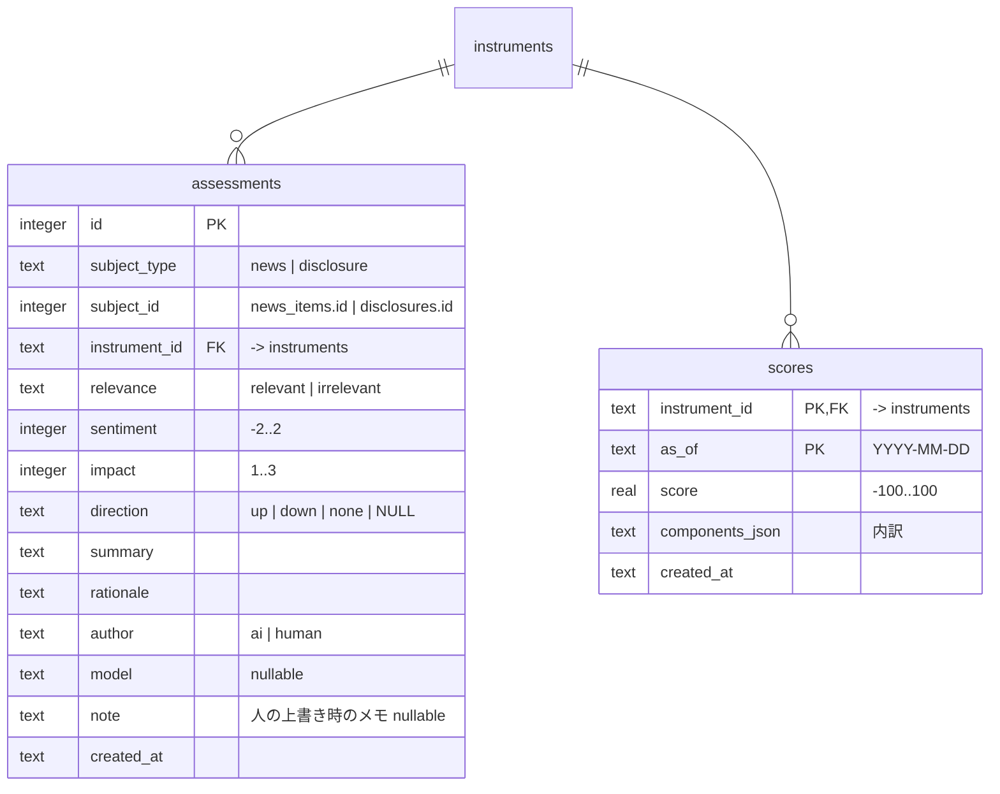

# Design Doc 0011: 判定とスコア（M2 後半）

| | |
| --- | --- |
| 状態 | 草案（壁打ち中） |
| 作成日 | 2026-09-20 |
| 元になる Design Doc | [0001](./0001-repository.md) §9 概念・§12 エージェント・付録 A、[0005](./0005-detect-and-dashboard.md)（detect）、[0010](./0010-real-data-collection.md)（事実の収集） |
| 対応するマイルストーン | [実行計画 0001](../execution-plans/0001-initial.md) M2 |

## 1. 背景と目的

0010 でニュース・開示・財務が貯まるようになった。これらは事実であり、「良いのか悪いのか」「持つ理由が崩れたのか」はまだ分からない。本書では

1. **判定（Assessment）**: ニュース・開示 1 件ごとの良し悪しを AI（エージェント）が付ける仕組み
2. **ファンダ系シグナル**: 判定と年次財務から 0001 付録 A の M2 分のシグナルを出す
3. **スコア**: 銘柄ごとの単一の数値（0001 §9）
4. **日次実行の自動化**（0001 の未決 U4）

を決める。AI は必ずツールの外（エージェントのスキル）に置き、ツールは AI なしで決定的に動く（0001 P3）。

## 2. スコープ / 非スコープ

### スコープ

- `assess` ツール: 未判定のニュース・開示を JSON で出す（開示は PDF 本文を抽出して同梱）、判定を書き込む、人の上書き
- `.agents/skills/assess/SKILL.md`: エージェントが判定を行う手順
- テーブル: `assessments`, `scores`
- `detect` にルール追加: `news_negative`, `forecast_down`, `dividend_cut`, `margin_deterioration`, `equity_ratio_drop`, `score_low`
- スコアの算出と保存（`detect run` の中で）
- ダッシュボード: 判定の表示、スコアの表示（保有一覧・銘柄詳細）、判定の上書き
- 日次実行の自動化: launchd（macOS）で `collect all` → `detect run` を平日夕方に実行。`assess` はエージェントが朝に実行（§3.6）

### 非スコープ

- 助言（「どう判断すべきか」）。M3 の `advise`
- 攻め（割安・成長のシグナル、ウォッチ）。M4
- XBRL の解析。PDF 本文で足りる前提（足りなければ M2 の補足で扱う）

## 3. 設計

### 3.1 判定（Assessment）

ニュース 1 件・開示 1 件に対して 1 つの判定を付ける。

| 項目 | 値 | 意味 |
| --- | --- | --- |
| `relevance` | `relevant` / `irrelevant` | 銘柄（企業）に関係する内容か。同名製品やスポーツ記事は `irrelevant` |
| `sentiment` | `-2` .. `+2` | 企業の価値・業績への影響の向きと強さ。`0` は中立 |
| `impact` | `1` .. `3` | 影響の大きさ。`3` は業績予想修正・大型の不祥事・減配など、`1` は話題程度 |
| `direction` | `up` / `down` / `none` | **業績予想修正・配当の開示にだけ**付ける。上方 / 下方（増配 / 減配） |
| `summary` | 1〜2 文 | 何が起きたか（日本語） |
| `rationale` | 引用 | 判定の根拠となった本文・見出しの抜粋。人が検証できるように |
| `author` | `ai` / `human` | AI 生成か、人の上書きか |
| `model` | 文字列 | AI のとき、使ったモデル名 |

- ニュースは **見出しだけ** を判定の材料にする（本文は取っていない）。見出しから判断できないときは `sentiment: 0, impact: 1` にし、`summary` にその旨を書く
- 開示は **PDF 本文** を材料にする。`assess pending` が本文を抽出して同梱する（`unpdf`。純 JS で外部プロセス不要。1 件 2 ページ程度）
- 同じ対象に `ai` の判定は 1 つ。人が上書きすると `human` の判定が追加され、以降は `human` を優先する（AI の判定は消さない）

### 3.2 `assess` ツールとスキル

```
pnpm assess pending [--limit 50] [--kind news|disclosure]   # 未判定を JSON で出す（開示は本文つき）
pnpm assess record --input <file|->                          # 判定を書き込む（配列）
pnpm assess override <assessment-id> --sentiment N [--impact N] [--direction up|down|none] [--note "..."]
pnpm assess list [--instrument JP:7203] [--since YYYY-MM-DD]
```

`pending` の出力例（抜粋）:

```json
{"ok":true,"data":{"items":[
  {"kind":"disclosure","id":12,"instrumentId":"JP:9503","name":"関西電力","title":"美浜発電所３号機の原子炉手動停止について","category":"other","disclosedAt":"2026-09-18T15:00:00+09:00","text":"（PDF 本文。最大 8,000 字）"},
  {"kind":"news","id":2210,"instrumentId":"JP:7203","name":"トヨタ自動車","title":"トヨタ、内製ロボ40万台を工場に","publisher":"日本経済新聞","publishedAt":"2026-09-18T00:00:00+09:00"}
],"remaining":37}}
```

`record` の入力は `{ kind, id, relevance, sentiment, impact, direction?, summary, rationale, model }` の配列。検証に通らない要素は `details` に列挙して **全体を失敗**にする（一部だけ書き込まない）。

#### スキル `.agents/skills/assess/SKILL.md`

エージェント（codex / Claude Code）が実行する手順:

1. `pnpm assess pending --limit 50` を実行し、JSON を読む
2. 各項目について §3.1 の基準で判定する。**見出し・本文に書かれていること以外を推測しない**。`rationale` には必ず引用を入れる
3. 判定の配列を一時ファイルに書き、`pnpm assess record --input <file>` で書き込む
4. `remaining > 0` なら 1 に戻る
5. 最後に `pnpm detect run` を実行し、結果（作られたシグナル・アクション）を報告する

スキルはデータストアを直接触らず、必ず CLI を経由する（0001 §12）。ニュースは 1 日 100 件前後の見出しが溜まるが、多くは `irrelevant` か `impact: 1` で、まとめて判定できる。

### 3.3 テーブル



- 一意制約: `assessments (subject_type, subject_id, author)`。`ai` は 1 件、`human` も 1 件（上書きの上書きは更新）
- 「その対象の有効な判定」= `human` があればそれ、無ければ `ai`
- `scores` は日次。`detect run` が `as_of` ごとに計算して上書きする

### 3.4 スコア

銘柄の「企業・株式としての状態」を -100〜+100 の 1 つの数値にする。**個人の損益（取得単価）は含めない**（それは `price_drop_cost` のシグナルが担う。スコアは M4 で「まだ持っていない銘柄」にも使うため）。

| 成分 | 計算 | 上下限 |
| --- | --- | --- |
| 判定（`assess`） | 直近 30 日の有効な判定について Σ `sentiment × impact × 減衰 × 5`。減衰は 14 日で半減（`0.5^(経過日数/14)`）。`irrelevant` は除く | ±50 |
| 株価（テクニカル） | 直近 60 日高値からの下落率 × 0.5（下落のみ）+ 200 日線より下なら -10 | -40..0 |
| 財務（年次） | 営業利益率の前年比変化（pt）× 2 + 自己資本比率の前年比変化（pt）× 1 | ±20 |

- `score = clamp(-100, 100, 判定 + 株価 + 財務)`
- 係数・上下限・減衰はすべて `config/detect.json` の `score` に置く。最初の値は上表。運用しながら調整する（0001 付録 A）
- 内訳は `components_json` に残し、ダッシュボードで「なぜこの点数か」を見られるようにする
- 判定が 1 件も無く、財務も無い銘柄のスコアは株価成分だけになる。それでよい（データが無いことを内訳で示す）

### 3.5 追加するシグナル（`detect run`）

0001 付録 A の M2 分。閾値は `config/detect.json`。

| kind | 条件（既定） | 重大度 | アクションの文面（事実の整理） |
| --- | --- | --- | --- |
| `news_negative` | 直近 7 日に `relevant` かつ `sentiment ≤ -1` かつ `impact ≥ 2` の判定 | `impact = 3` なら critical、それ以外 warn | 見出し、判定の要約と引用、リンク |
| `forecast_down` | `forecast_revision` の開示に `direction = down` の判定 | critical | 開示の表題、要約、PDF リンク |
| `dividend_cut` | `dividend` の開示に `direction = down` の判定 | critical | 同上 |
| `margin_deterioration` | 年次の営業利益率が前年比 -3pt 以下（warn）/ -6pt 以下（critical） | | 前年と当年の売上・営業利益・利益率 |
| `equity_ratio_drop` | 年次の自己資本比率が前年比 -5pt 以下（warn）/ -10pt 以下（critical） | | 前年と当年の総資産・自己資本・比率 |
| `score_low` | スコア ≤ -40（warn）/ ≤ -60（critical） | | スコアと内訳 |

- シグナルの一意性・アクションの重複抑制は 0005 と同じ規則。`news_negative` / `forecast_down` / `dividend_cut` は **判定の対象（ニュース・開示）ごと** に 1 つで、`details_json` に `subject_type` / `subject_id` を持つ
- 実行順: `collect all` → （エージェントが `assess`）→ `detect run`。`assess` を挟まずに `detect run` しても、株価・財務のルールは動く

### 3.6 日次実行の自動化（0001 の未決 U4）

| 処理 | 実行方法 | 時刻（JST） |
| --- | --- | --- |
| `collect all` → `detect run` | **launchd**（macOS の標準スケジューラ）。`~/Library/LaunchAgents/com.trading-tools.daily.plist` を `pnpm schedule install` で生成・登録する | 平日 18:30 |
| `assess`（AI 判定）→ `detect run` | **エージェントを人が起動**。朝、Claude Code / codex で「assess を実行して」と言う。慣れたら `claude -p "/assess"` を launchd から呼ぶ形に進める（要検証） | 朝 |

- Mac が起動していない日は実行されない。翌日の `collect all` が取れる分（株価は Yahoo が直近を返す、ニュースは 100 件、開示は前日分も取る）で埋まる。1 日以上の穴は `collect quotes --backfill` で埋める
- 失敗はログ（`data/logs/daily-YYYY-MM-DD.log`）に残し、ダッシュボードの「株価が古い」バナーで気づく
- Claude Code のクラウド定期実行（scheduled tasks）は **使わない**。ローカルの SQLite に届かないため

### 3.7 ダッシュボード

| 画面 | 追加 |
| --- | --- |
| 保有一覧 | スコア列（数値 + 色: ≤ -40 で warn、≤ -60 で critical の文字色） |
| 銘柄詳細 | スコアと内訳（判定 / 株価 / 財務）、ニュース・開示の各行に判定バッジ（`+2` .. `-2` と `impact`）と要約、判定の上書き（`features/override-assessment`: sentiment を選んで保存） |
| アクション一覧 | 新しい kind のラベル（`entities/action` の `KIND_LABEL` に追加） |

### 3.8 パッケージ構成

| パス | 内容 |
| --- | --- |
| `packages/db/src/schema/{assessments,scores}.ts` | テーブル |
| `packages/domain/src/{assessments,scores}.ts` | 有効な判定の取得、スコアの読み書き |
| `packages/market-data/src/pdf.ts` | PDF 本文の抽出（`unpdf`） |
| `tools/assess/` | `pending` / `record` / `override` / `list` |
| `tools/detect/src/rules/` | ルールを kind ごとに分ける（0005 の 4 つも移す）。`score.ts` にスコア |
| `tools/schedule/` | `install` / `uninstall` / `status`（launchd） |
| `.agents/skills/assess/SKILL.md` | スキル |
| `apps/dashboard` | `entities/assessment`、`widgets/score-card`、`features/override-assessment` |

## 4. 検討した選択肢と決定

| 論点 | 決定 | 却下した選択肢と理由 |
| --- | --- | --- |
| AI の呼び出し | エージェントのスキル。ツールは JSON の出し入れだけ | ツール内で LLM API を呼ぶ: 0001 P3 に反する。cron から AI を動かせる利点はあるが、API キー管理とプロンプトの二重管理が要る |
| ニュースの材料 | 見出しのみ | 本文を取る: 各媒体のスクレイピングになり、規約・構造の問題が媒体数だけ増える |
| 開示の材料 | PDF 本文（`unpdf`） | XBRL: 決算短信サマリーは構造化されているが、業績予想修正の「向き」は PDF 本文の方が確実に書かれている。XBRL は将来 |
| 判定の粒度 | 1 件 1 判定 | 銘柄・日ごとにまとめて 1 判定: 根拠の引用が曖昧になり、人が検証できない |
| スコアに損益を含めるか | 含めない | 含める: スコアが「企業の状態」でなくなり、M4 で未保有銘柄と比べられない |
| スコアの形 | 加算 + clamp | 乗算や機械学習: 説明できない。内訳を人が読めることを優先 |
| 日次実行 | launchd（決定的な処理）+ 人が起動するエージェント（AI 判定） | Claude Code のクラウド定期実行: ローカル DB に届かない。全部 launchd から `claude -p`: 未検証。段階的に |
| 人の上書き | `human` の判定を追加して優先 | AI の判定を書き換える: AI の判定精度を後から評価できなくなる |

## 5. リスク・未決事項

| # | 内容 | 対応 |
| --- | --- | --- |
| R1 | AI 判定の精度（見出しだけでは誤判定する） | `impact` を控えめに付けるようスキルに書く。`rationale` の引用で人が検証し、上書きできる。誤判定の傾向は `human` と `ai` の差分から見える |
| R2 | 1 日 100 件の見出しを毎朝判定するのは手間 | `pending` はまず開示と `impact` が大きそうなもの（`irrelevant` でないもの）から出す。慣れたら `claude -p` で自動化 |
| R3 | PDF が画像のみ（スキャン）で本文が取れない | `text` が空なら表題だけで判定し、`summary` にその旨を書く |
| R4 | スコアの係数が的外れ | 内訳を見て `config/detect.json` で調整。M5 の振り返りで「スコアが下がった後に何が起きたか」を見る |
| R5 | launchd の環境（PATH、Node のバージョン）で失敗する | plist に `pnpm` の絶対パスと作業ディレクトリを書く。ログで確認 |
| U1 | `claude -p` を launchd から呼んで `assess` を自動化できるか | M2 の完了後に試す。できれば 0011 の補足に記録 |

## 要確認

1. 判定の項目（relevance / sentiment / impact / direction / summary / rationale）でよいか
2. スコアの構成（判定 ±50、株価 -40..0、財務 ±20、損益は含めない）でよいか
3. 日次実行を launchd + 朝にエージェントを人が起動、という分担でよいか
4. ニュースは見出しだけで判定する、でよいか
