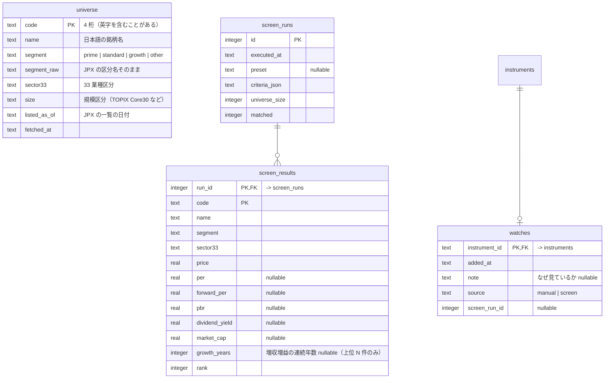

# Design Doc 0013: 攻め — ウォッチ銘柄とスクリーニング（M4）

| | |
| --- | --- |
| 状態 | 実装済み（2026-09-20） |
| 作成日 | 2026-09-20 |
| 元になる Design Doc | [0001](./0001-repository.md) §3 G4・付録 A（M4 分）、[0009](./0009-data-sources.md)、[0011](./0011-assessment-and-score.md)（スコア）、[0012](./0012-advise.md)（助言） |
| 対応するマイルストーン | [実行計画 0001](../execution-plans/0001-initial.md) M4 |

## 1. 背景と目的

守り（保有銘柄の監視）は M3 までで一通り動く。利用者の 2 つ目の困りごと「買えば良かったのに見過ごした」に対して、

1. **ウォッチ銘柄**: まだ持っていない銘柄を保有銘柄と同じ仕組み（収集・判定・スコア・検知・助言）で監視し、買い時の候補になったらアクションを出す
2. **スクリーニング**: 東証の上場銘柄から条件で候補を探し、ウォッチに載せる

を実現する。

### 検証結果（2026-09-20）

| 項目 | 結果 |
| --- | --- |
| 母集団 | JPX の「東証上場銘柄一覧」（`data_j.xlsx`、月次更新、無料）。4,441 行。証券コード、**日本語の銘柄名**、市場区分（プライム 1,556 / スタンダード 1,555 / グロース 596 / ETF 等）、33 業種、規模区分（TOPIX Core30 等） |
| 一括の指標取得 | Yahoo の `quote()` に 100 銘柄ずつ渡して、300 銘柄を 2.3 秒。PER 96%、PBR・配当利回り・時価総額 100% の取得率。プライム全体で約 16 リクエスト・12 秒 |

## 2. スコープ / 非スコープ

### スコープ

- テーブル: `universe`（上場銘柄一覧）、`watches`、`screen_runs`、`screen_results`
- `universe` の取り込み（JPX の xlsx）。ウォッチ追加時の銘柄名とスクリーニングの母集団に使う
- `watch` ツール: `add` / `remove` / `list`
- 監視対象を「保有 ∪ ウォッチ」に広げる（`collect` / `detect` / `assess` / `advise` すべて）
- 攻めのルール（0001 付録 A の M4 分）: `valuation_cheap` / `growth_streak` / `oversold_quality`。**ウォッチ銘柄にだけ**適用する
- `screen` ツール: 条件で母集団を絞り、結果を保存する
- 助言（`advise`）のウォッチ向け `stance`
- ダッシュボード: ウォッチ一覧、スクリーナー（最新の結果と「ウォッチに追加」）、アクションの「攻め」表示

### 非スコープ

- 保有銘柄への「買い増し」の判断（攻めのルールは保有には適用しない。買い増しは M5 以降で検討）
- 業種内の相対評価（同業比較）。母集団に 33 業種はあるので将来できる
- 指標の過去レンジ（PER の 3 年レンジ等）に基づく割安判定。`fundamentals` の履歴が溜まったら（1 年以上）0001 付録 A の定義に戻す

## 3. 設計

### 3.1 テーブル



- `universe` は `pnpm collect universe` で入れ替える（全件 upsert。月 1 回で十分。`collect all` には含めない）
- `watches` を足すと `instruments` に行が要る。名前は `universe` から取る（無ければ `--name` が必須）
- 監視対象（`monitoredTargets`）= 最新スナップショットの保有 ∪ `watches`。`holdingTargets` を置き換える。保有もウォッチもされている銘柄は 1 つに数える

### 3.2 `watch` ツール

```
pnpm watch add <code> [--note "..."]      # universe に無ければ --name が必須
pnpm watch remove <code>
pnpm watch list                            # 最新の株価・スコア・未対応アクション数つき
```

- `add` 後、次の `collect quotes` で日足が 1 年分入り、翌日から `drawdown_60d` / `below_ma200` / 攻めのルールの対象になる（0010 の自動遡り）
- `remove` はウォッチ行を消すだけ。`instruments` と事実（株価・ニュース）は残す
- 保有している銘柄を `add` すると `already_held` で失敗（保有銘柄は既に監視されている）

### 3.3 攻めのルール（`detect run`、ウォッチ銘柄のみ）

| kind | 条件（既定。`config/detect.json`） | 重大度 | アクションの文面 |
| --- | --- | --- | --- |
| `valuation_cheap` | PER ≤ 12 かつ PBR ≤ 1.0 かつ 配当利回り ≥ 3.0%（最新の `fundamentals`。値が無い項目は条件を満たさないとみなす） | warn | 3 指標の値と、母集団の中央値（`screen_results` の最新があれば） |
| `growth_streak` | 年次の売上と営業利益が **3 年連続** で前年を上回る（4 期分が要る） | warn | 4 期分の売上・営業利益 |
| `oversold_quality` | 200 日線より下、かつ 60 日高値から -15% 以下、かつ（`growth_streak` または `valuation_cheap` が成立） | critical | 株価の位置と、成立した方の事実 |

- 重大度は「候補としての強さ」を表す（守りの「悪さ」とは意味が違う）。ダッシュボードでは攻めのアクションに「買い検討」のバッジ（`badge-primary`）を付けて区別する
- 守りのルール（`price_drop_cost` 以外）はウォッチ銘柄にも適用する。取得単価が無いので `price_drop_cost` は評価しない
- アクションの重複抑制は 0005 と同じ。攻めのアクションが `done` になったら（= 買った、または見送った）、`reissue_after_days` まで再発行しない

### 3.4 スコアの位置づけ

スコアは個人の損益を含まない（0011）ので、ウォッチ銘柄でも同じ式で計算できる。攻めの判断では「スコアが高く（企業が良く）、株価が下がっている」を探す。これは `oversold_quality` がルールとして表現している。

### 3.5 `screen` ツール

```
pnpm screen run [--preset <name>] [--segment prime,standard] [--per-max N] [--pbr-max N] [--dividend-min N]
                [--market-cap-min N] [--sector <33業種>] [--growth-years N] [--limit 50]
pnpm screen list                       # 過去の実行
pnpm screen show <run-id>              # 結果
```

| 段階 | 処理 |
| --- | --- |
| 1. 母集団 | `universe` から `--segment`（既定 `prime,standard`）と `--sector` で絞る。ETF・REIT・外国株は除く |
| 2. 一括取得 | Yahoo の `quote()` に 100 銘柄ずつ渡し、株価・PER・予想 PER・PBR・配当利回り・時価総額を取る（Provider に `fetchQuoteMetrics` を追加） |
| 3. 絞り込み | `--per-max` 等の条件で絞る。値が無い項目は条件を満たさないとみなす |
| 4. 並べ替え | 既定は配当利回りの高い順（プリセットで変える） |
| 5. 成長の確認 | 上位 `--limit` 件（既定 50）だけ年次の財務を取り、増収増益の連続年数を付ける。`--growth-years N` 指定時はここで N 未満を落とす |
| 6. 保存 | `screen_runs` と `screen_results` に保存し、JSON で返す |

プリセット（`config/screen.json`）:

| name | 条件 | 意図 |
| --- | --- | --- |
| `value` | PER ≤ 12、PBR ≤ 1.0、配当利回り ≥ 3.0%、時価総額 ≥ 300 億円 | 割安・高配当 |
| `growth` | 増収増益 3 年連続、PER ≤ 25、時価総額 ≥ 300 億円 | 成長・妥当な評価 |
| `quality` | ROE ≥ 10%、営業利益率 ≥ 10%、自己資本比率 ≥ 40%、配当利回り ≥ 2% | 質（`fundamentals` は上位 N 件だけ個別に取る） |

- 母集団の指標は保存しない（`screen_results` に残るのは絞り込み後だけ）。毎回取り直す。1 回 10〜20 秒
- Yahoo への負荷: 100 銘柄 / リクエスト × 30 回程度。300ms 空ける。1 日に何度も回さない前提（ダッシュボードから連打しない。実行は CLI のみ）

### 3.6 助言（`advise`）のウォッチ向け

事実の束に `context: 'holding' | 'watch'` を足す。ウォッチのときは `position` が無く、代わりに `screen_results` の直近の値（あれば）と `watches.note`（なぜ見ているか）を入れる。

| context | stance | 意味 |
| --- | --- | --- |
| `holding` | `hold` / `review` / `reduce` | 0012 のとおり |
| `watch` | `candidate` / `review` / `pass` | 買いの候補として進める価値がある / 判断材料が足りない / 今は見送る |

`candidate` は、束に **企業側の良さ**（増収増益、利益率、判定の好材料）と **株価の位置**（下落・割安）の両方があるときだけ。株価の下落だけなら `review`。スキルに明記する。

### 3.7 ダッシュボード

| 画面 | 内容 |
| --- | --- |
| `/watch` | ウォッチ一覧: 銘柄、追加日、メモ、株価、60 日高値比、200 日線比、スコア、未対応アクション数。削除ボタン |
| `/screener` | 最新の実行結果の表（順位、銘柄、市場、業種、株価、PER、PBR、配当利回り、時価総額、増収増益年数）。各行に「ウォッチに追加」。過去の実行の切り替え。実行は CLI（画面から回さない） |
| `/`（アクション一覧） | 攻めのアクションに「買い検討」バッジ。タブに「守り / 攻め」の絞り込み |
| `/instruments/$id` | ウォッチ銘柄でも同じ画面。保有が無ければ「ウォッチ中（追加日、メモ）」を出す |
| ナビ | アクション / 保有 / ウォッチ / スクリーナー |

### 3.8 パッケージ構成

| パス | 内容 |
| --- | --- |
| `packages/db/src/schema/{universe,watches,screen-runs,screen-results}.ts` | テーブル |
| `packages/market-data/src/jpx.ts` | 上場銘柄一覧の取得と xlsx の解析（`xlsx` パッケージ） |
| `packages/market-data/src/yahoo.ts` | `fetchQuoteMetrics`（一括） |
| `packages/domain/src/{watches,universe,screen}.ts` | 監視対象、ウォッチ、スクリーニングの読み書き |
| `tools/watch/`, `tools/screen/` | CLI |
| `tools/collect/src/universe.ts` | `collect universe` |
| `tools/detect/src/rules/offense.ts` | 攻めのルール |
| `config/screen.json` | プリセット |
| `apps/dashboard` | `pages/watch`、`pages/screener`、`features/add-watch`、`features/remove-watch`、`entities/watch` |

## 4. 検討した選択肢と決定

| 論点 | 決定 | 却下した選択肢と理由 |
| --- | --- | --- |
| 母集団 | JPX の上場銘柄一覧（xlsx） | Yahoo のスクリーナー: 非公式 API の中でも不安定。手入力: 4,000 銘柄は無理 |
| ウォッチ銘柄の名前 | `universe` から | Yahoo の `shortName`: 英語（TOYOTA MOTOR CORP）でニュース検索に使えない |
| 割安の定義 | 絶対値の閾値（PER ≤ 12 等） | 過去レンジの下位（0001 付録 A）: `fundamentals` の履歴がまだ無い。1 年溜まったら切り替える |
| 攻めのルールの適用範囲 | ウォッチ銘柄のみ | 保有にも: 「買い増し」の判断は集中度の問題を伴い、別の設計が要る |
| スクリーニングの実行場所 | CLI のみ | ダッシュボードから: Yahoo への負荷を利用者の操作で増やさない。結果の閲覧だけ画面 |
| 母集団の指標の保存 | 保存しない | 保存: 4,000 銘柄 × 日次で肥大化。必要なら `screen_results` の上位だけ残る |
| ウォッチの助言 | `stance` を context で切り替え | 同じ 3 値を流用: 「保有継続」はウォッチに意味が無い |

## 5. リスク・未決事項

| # | 内容 | 対応 |
| --- | --- | --- |
| R1 | JPX の xlsx の URL や列名が変わる | 列名を検証し、違えば `unexpected_format`。URL は設定で上書きできるようにする |
| R2 | 一括 `quote()` の PER が無い銘柄（赤字など）が条件から漏れる | 「値が無い = 条件を満たさない」を明記。赤字銘柄は `value` プリセットの対象外でよい |
| R3 | ウォッチ銘柄が増えるとニュースの判定（`assess`）の量が増える | ウォッチは 20 銘柄程度を想定。`assess pending` は開示と新しいものを優先しているので、古いニュースは放置できる |
| R4 | 絶対値の閾値は業種でばらつく（銀行の PBR は低い等） | プリセットは業種を絞れる。業種内の相対評価は非スコープ |

## 決定事項（壁打ちの結果）

| 論点 | 決定 |
| --- | --- |
| 割安の既定 | PER ≤ 12、PBR ≤ 1.0、配当利回り ≥ 3%、時価総額 ≥ 300 億円。指標の履歴が溜まったら過去レンジに切り替える |
| 攻めのルールの適用範囲 | ウォッチ銘柄のみ |
| 母集団の既定 | プライム + スタンダード |
| ウォッチの stance | candidate / review / pass |

## 実装時の補足（2026-09-20）

- JPX の xlsx は `data_j.xlsx`（`.xls` は 404）。`xlsx`（SheetJS 0.18、Apache-2.0）で解析。実データで 4,434 行（プライム 1,550 / スタンダード 1,557 / グロース 598）
- `screen run --preset value` を実データで実行: 母集団 3,107 → 50 件、約 100 秒。時間の大半は上位 50 件の財務取得（1 銘柄 2 リクエスト）
- ウォッチから外すとき、保有していなければその銘柄の未対応アクション（と助言）を「見送り」にする（メモ「ウォッチから外した」）。外したのに「買い検討」が残るのを防ぐ
- 助言の `stance` は保有とウォッチで集合が違う。`advise record` が銘柄の状態（保有か否か）を見て検証する（`bad_stance`）
- ウォッチの 1 銘柄で流れを通した: `watch add` → `collect quotes` が 243 本を自動遡り → `detect run` で `valuation_cheap` → 「買い検討」のアクション → ダッシュボードのウォッチ・スクリーナー・銘柄詳細で表示 → 「外す」で見送りに
