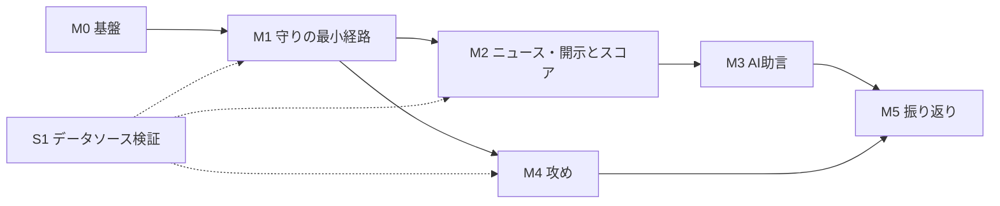

# 実行計画 0001: 最初の計画（M0〜M5）

| | |
| --- | --- |
| 状態 | 承認（2026-09-19） |
| 元になる Design Doc | [0001 リポジトリ全体](../design-docs/0001-repository.md) |
| 作成日 | 2026-09-19 |

## 進め方の原則

- マイルストーンは **動いて確認できるもの** を単位にする。完了の定義は「人が手を動かして確認できる手順」で書く
- マイルストーンに着手する前に、その変更の Design Doc を書いて承認を得る。番号は着手順に振るため、以下の番号は目安
- 1マイルストーンはエージェントに渡して数セッションで終わる大きさにする。大きければ分ける
- データソースの検証（スパイク）は本線と並行して進め、本線をブロックしない

## 全体像

| # | マイルストーン | 到達点（ひとこと） | 状態 |
| --- | --- | --- | --- |
| M0 | 基盤 | エージェントが迷わず着手できる | 完了（2026-09-19） |
| M1 | 守りの最小経路 | 「検知 → 確認」が一本通る | 完了（2026-09-20） |
| M2 | ニュース・開示とスコア | 「悪いニュースでスコアが下がる」が動く | 0010 壁打ち中 |
| M3 | AI助言 | 「何をすべきか」が出る | 未着手 |
| M4 | 攻め | 「見過ごし」を減らせる | 未着手 |
| M5 | 振り返り | 判断の改善に使える | 未着手 |
| S1 | データソース検証（並行） | 株価・ニュース・開示の取得元が決まる | 完了（2026-09-20、0009） |

---

## M0: 基盤

### 目的

ツール群が同居する土台を作り、以降のマイルストーンをエージェントが迷わず進められる状態にする。

### スコープ

- pnpm ワークスペース（`tools/`, `apps/`, `packages/`）、TypeScript 設定、lint / test の共通設定
- `packages/` にデータストア（SQLite）の初期化・マイグレーションと、CLI の共通規約（引数、JSON 入出力、終了コード、ログ）
- `AGENTS.md` を実装フェーズ向けに更新（CLI 規約、日次実行の手順、実装の入り方）。`.agents/skills/` の置き場
- `data/source/`, `data/` の配置と `.gitignore`

### スコープ外

- 業務ロジック。テーブルは M1 で最初に必要になるものだけ（M0 ではテーブルを作らない）

### 着手前に書く Design Doc

- 0002: 基盤（ワークスペース構成、データストアとマイグレーション方式、CLI 規約、AGENTS.md の構成）

### 完了の定義

- [x] `pnpm install && pnpm test && pnpm lint && pnpm typecheck` が通る（ビルド工程はない。0002 で tsx 直接実行に決定）
- [x] `pnpm db migrate` で `data/trading.db` が作られる（空のスキーマ）
- [x] CLI 規約に沿ったコマンドが1つある（`db migrate` / `db status`。stdout は常に JSON、`--json` は不要と 0002 で決定）
- [x] `AGENTS.md` に M1 の Design Doc の場所と実装の入り方がある
- [x] `git status` に個人データ・DB が出ない

---

## M1: 守りの最小経路

### 目的

保有銘柄について「検知 → 確認 → 対応済みにする」を一本通す。データソースが未決でも通せるようにする。

### スコープ

- `import-holdings`: 楽天証券 CSV → 銘柄・保有スナップショット
- `collect`: 保有銘柄の株価取得。S1 が終わっていなければ **モック実装**（手入力 or 固定値）で通す
- `detect`: 「前日比・取得単価比で N% 以上の下落」のルールでシグナルとアクション（ルール生成）を作る
- `dashboard`: アクション一覧（未対応 / 対応済み）、保有銘柄と最新株価、対応済みにする操作

### スコープ外

- ニュース・開示、スコア、AI 助言、ウォッチ銘柄、チャート

### 着手前に書く Design Doc

- 0003（実装済み）: 入力側 — `import-holdings`（CSV の列定義、文字コード、銘柄・保有のテーブル）と `collect`（株価の取得と保存。Provider 抽象、モック実装、S1 の結果で差し替え）
- 0005（実装済み。0004 はスキーマ図に使用）: 出力側 — `detect`（下落ルール、シグナル・アクションのテーブル、閾値の設定方法）と `dashboard`（画面遷移、アクション一覧と銘柄詳細の最小構成）

### 解消する未決事項

- U1, U5: 楽天証券 CSV の実物確認（Design Doc 0003 の前提）

### 完了の定義

- [x] 実物の楽天証券 CSV を `data/source/` に置き、`import-holdings` で取り込める
- [x] `collect` で保有銘柄の株価が保存される（モックでも可）
- [x] 株価を下落させた状態で `detect` を実行すると、該当銘柄のシグナルとアクションが作られる（モックの株価を -25% にして確認）
- [x] ダッシュボードにアクションが表示され、対応済みにできる
- [x] 同じ日に `collect` / `detect` を2回実行しても、アクションが重複しない
- [x] `import-holdings` → `collect` → `detect` を **手動で** 日次実行できる手順が `AGENTS.md` と README にある

---

## S1: データソース検証（M1 と並行）

### 目的

日本株の株価・指標・ニュース・適時開示について、取得可否・利用規約・コスト・鮮度を確認し、採用を決める。

### 進め方

候補ごとに小さなスクリプトで実際に取得し、結果を Design Doc 0005（データソース選定）に記録する。

| 種類 | 候補 | 確認すること |
| --- | --- | --- |
| 株価・指標 | Yahoo Finance（非公式） | 日本株の取得可否、PER 等の指標、利用規約 |
| 株価・指標・業績予想・**四半期決算** | J-Quants | 無料プランの遅延、有料プランの価格、業績予想と決算（売上・営業利益・自己資本比率）の形 |
| 適時開示 | TDnet | 銘柄別に取れるか、ページ構造、更新タイミング |
| ニュース | Google News RSS | 銘柄名検索の精度、ノイズの量 |

### 完了の定義

- [x] 株価・指標の取得元が決まり、`collect` のモックを実装に差し替えられる（Yahoo Finance）
- [x] ニュース・開示の取得元が決まる（Google News RSS / TDnet）
- [x] 決算データの取得元が決まる（Yahoo の年次。四半期は J-Quants を契約しないため TDnet + AI で代替）
- [x] 各取得元の利用条件（規約・レート制限・費用）が Design Doc に記録されている（0009）

---

## M2: ニュース・開示とスコア

### 目的

ニュース・適時開示を集め、エージェントが良い/悪いを判定し、スコアに反映する。「悪いニュースでスコアが下がる」を動かす。

### スコープ

- `collect`: ニュース・開示の取得（S1 の結果に従う）
- 判定（Assessment）の書き込み CLI と、判定を行うエージェントのスキル `assess`
- `detect`: スコア算出（判定 + 株価変化 + 指標）、スコアの変化によるシグナル
- `dashboard`: 銘柄詳細にニュース・開示・判定・スコア推移を表示
- 日次実行の環境を決めて設定する（U4）

### 着手前に書く Design Doc

- 0010: 実データの収集 — Provider（yahoo / google-news / tdnet）、`collect` の拡張、テーブル
- 0011: 判定とスコア — `assess` スキルと判定のデータ構造（根拠の引用、人による上書き）、スコアの算出式・重み・閾値、日次実行の環境（U4）

### 完了の定義

- [ ] 保有銘柄のニュース・開示が日次で保存される
- [ ] エージェントが `assess` で判定を付け、CLI 経由で保存される
- [ ] 悪い判定が付くとスコアが下がり、閾値を超えるとシグナルが出る
- [ ] 判定に根拠が残り、ダッシュボードで人が上書きできる
- [ ] 日次実行が決めた環境で回り、実行失敗がダッシュボードで分かる（データが古い表示）

---

## M3: AI 助言

### 目的

シグナルに対して「どう判断すべきか」をエージェントが生成し、アクションとして出す。

### スコープ

- `advise` スキル: 未処理のシグナルと事実を読み、助言をアクション（AI 生成）として CLI 経由で書き込む
- `dashboard`: ルール生成と AI 生成の区別、助言は判断材料であり最終判断は人であることの明示（R5）

### 着手前に書く Design Doc

- 0009: `advise`（入力の範囲、出力の形、重複防止、助言の品質を後から評価する手がかり）

### 完了の定義

- [ ] シグナルが出た翌朝、対応する助言つきアクションがダッシュボードにある
- [ ] 同じシグナルに助言が二重に付かない
- [ ] 助言に、参照した事実（株価、ニュース、開示）へのリンクがある

---

## M4: 攻め

### 目的

まだ持っていない銘柄を監視し、買い時を見過ごさない。

### スコープ

- ウォッチ銘柄の追加・削除（CLI と画面）
- `collect` / `detect` の対象にウォッチ銘柄を含める。同じスコアを「攻め」の閾値で読む（割安シグナル）
- `screen`: 条件（PER / PBR / 配当利回り等）で候補を探し、ウォッチに追加する

### 着手前に書く Design Doc

- 0010: ウォッチと攻めの閾値
- 0011: `screen`（対象銘柄の母集団をどう用意するか — S1 の結果に依存）

### 完了の定義

- [ ] ウォッチ銘柄を追加すると、翌日から株価・ニュースが集まりスコアが付く
- [ ] ウォッチ銘柄が閾値まで下がると「買い検討」のアクションが出る
- [ ] 条件を指定してスクリーニングし、結果からウォッチに追加できる

---

## M5: 振り返り

### 目的

過去のアクション・事実・助言を時系列で見て、判断の改善に使う。

### スコープ

- 銘柄ごとのタイムライン（株価、スコア、シグナル、アクション、助言）
- アクションの履歴（対応済み / 見送りと、そのときの根拠）

### 着手前に書く Design Doc

- 0012: 振り返り画面

### 完了の定義

- [ ] 銘柄詳細で、過去のシグナルとアクションと当時のスコアを時系列で見られる
- [ ] 「見送り」にしたアクションを後から一覧できる

---

## 決定事項（壁打ちの結果）

| 論点 | 決定 |
| --- | --- |
| M1 の Design Doc の本数 | 2本（入力側 0003 / 出力側 0004） |
| S1 の時期 | M1 と並行。M1 は株価をモックで通す |
| M2 と M4 の順序 | M2 → M3 → M4（守りを完成させてから攻め） |
| マイルストーンの大きさ | このまま |
