# データストアのスキーマ（現在）

**このファイルは自動生成。手で編集しない。** 生成元は `packages/db/src/schema/`、生成コマンドは `pnpm db:erd`。
古くなっていると `pnpm test` が落ちる。各テーブルの設計意図は、定義した Design Doc を参照。

| テーブル | 定義した Design Doc |
| --- | --- |
| `actions` | [0005](design-docs/0005-detect-and-dashboard.md) |
| `assessments` | [0011](design-docs/0011-assessment-and-score.md) |
| `disclosures` | [0010](design-docs/0010-real-data-collection.md) |
| `financials` | [0010](design-docs/0010-real-data-collection.md) |
| `fundamentals` | [0010](design-docs/0010-real-data-collection.md) |
| `holding_snapshots` | [0003](design-docs/0003-holdings-and-quotes.md) |
| `holdings` | [0003](design-docs/0003-holdings-and-quotes.md) |
| `instruments` | [0003](design-docs/0003-holdings-and-quotes.md) |
| `news_items` | [0010](design-docs/0010-real-data-collection.md) |
| `quotes` | [0003](design-docs/0003-holdings-and-quotes.md) |
| `scores` | [0011](design-docs/0011-assessment-and-score.md) |
| `signals` | [0005](design-docs/0005-detect-and-dashboard.md) |

```mermaid
erDiagram
    actions {
        integer id PK
        text instrument_id FK "-> instruments"
        integer signal_id FK "-> signals; unique(signal_id, origin); nullable"
        text origin "unique(signal_id, origin)"
        text title
        text body
        text status
        text note "nullable"
        text created_at
        text resolved_at "nullable"
    }
    assessments {
        integer id PK
        text subject_type "unique(subject_type, subject_id, author)"
        integer subject_id "unique(subject_type, subject_id, author)"
        text instrument_id FK "-> instruments"
        text relevance
        integer sentiment
        integer impact
        text direction "nullable"
        text summary
        text rationale
        text author "unique(subject_type, subject_id, author)"
        text model "nullable"
        text note "nullable"
        text created_at
    }
    disclosures {
        integer id PK
        text instrument_id FK "-> instruments; unique(instrument_id, pdf_url)"
        text disclosed_at
        text title
        text pdf_url "unique(instrument_id, pdf_url)"
        text category
        integer has_xbrl
        text source
        text fetched_at
    }
    financials {
        text instrument_id PK,FK "-> instruments"
        text period_type PK
        text period_end PK
        text source PK
        real revenue "nullable"
        real operating_income "nullable"
        real net_income "nullable"
        real total_assets "nullable"
        real equity "nullable"
        real operating_cash_flow "nullable"
        real eps "nullable"
        text fetched_at
    }
    fundamentals {
        integer id PK
        text instrument_id FK "-> instruments; unique(instrument_id, as_of, source)"
        text as_of "unique(instrument_id, as_of, source)"
        real per "nullable"
        real forward_per "nullable"
        real pbr "nullable"
        real dividend_yield "nullable"
        real market_cap "nullable"
        real roe "nullable"
        real operating_margin "nullable"
        real revenue_growth "nullable"
        real debt_to_equity "nullable"
        text next_earnings_date "nullable"
        text source "unique(instrument_id, as_of, source)"
        text fetched_at
    }
    holding_snapshots {
        integer id PK
        text source "unique(source, as_of)"
        text as_of "unique(source, as_of)"
        text file_name
        text imported_at
        integer row_count
        text skipped_json
    }
    holdings {
        integer snapshot_id PK,FK "-> holding_snapshots"
        text instrument_id PK,FK "-> instruments"
        text account PK
        integer quantity
        real average_cost
        real price_at_snapshot
        integer market_value
        integer unrealized_pnl
        real unrealized_pnl_pct
    }
    instruments {
        text id PK
        text market
        text code
        text name
        text created_at
        text updated_at
    }
    news_items {
        integer id PK
        text instrument_id FK "-> instruments; unique(instrument_id, url)"
        text published_at
        text title
        text url "unique(instrument_id, url)"
        text publisher "nullable"
        text source
        text fetched_at
    }
    quotes {
        integer id PK
        text instrument_id FK "-> instruments; unique(instrument_id, as_of, source)"
        text as_of "unique(instrument_id, as_of, source)"
        real price
        real previous_close "nullable"
        text source "unique(instrument_id, as_of, source)"
        text fetched_at
    }
    scores {
        text instrument_id PK,FK "-> instruments"
        text as_of PK
        real score
        text components_json
        text created_at
    }
    signals {
        integer id PK
        text instrument_id FK "-> instruments; unique(instrument_id, kind, as_of)"
        text kind "unique(instrument_id, kind, as_of)"
        text as_of "unique(instrument_id, kind, as_of)"
        text severity
        real value
        text details_json
        text created_at
        text updated_at
    }
    holding_snapshots ||--o{ holdings : ""
    instruments ||--o{ actions : ""
    instruments ||--o{ assessments : ""
    instruments ||--o{ disclosures : ""
    instruments ||--o{ financials : ""
    instruments ||--o{ fundamentals : ""
    instruments ||--o{ holdings : ""
    instruments ||--o{ news_items : ""
    instruments ||--o{ quotes : ""
    instruments ||--o{ scores : ""
    instruments ||--o{ signals : ""
    signals ||--o{ actions : ""
```

