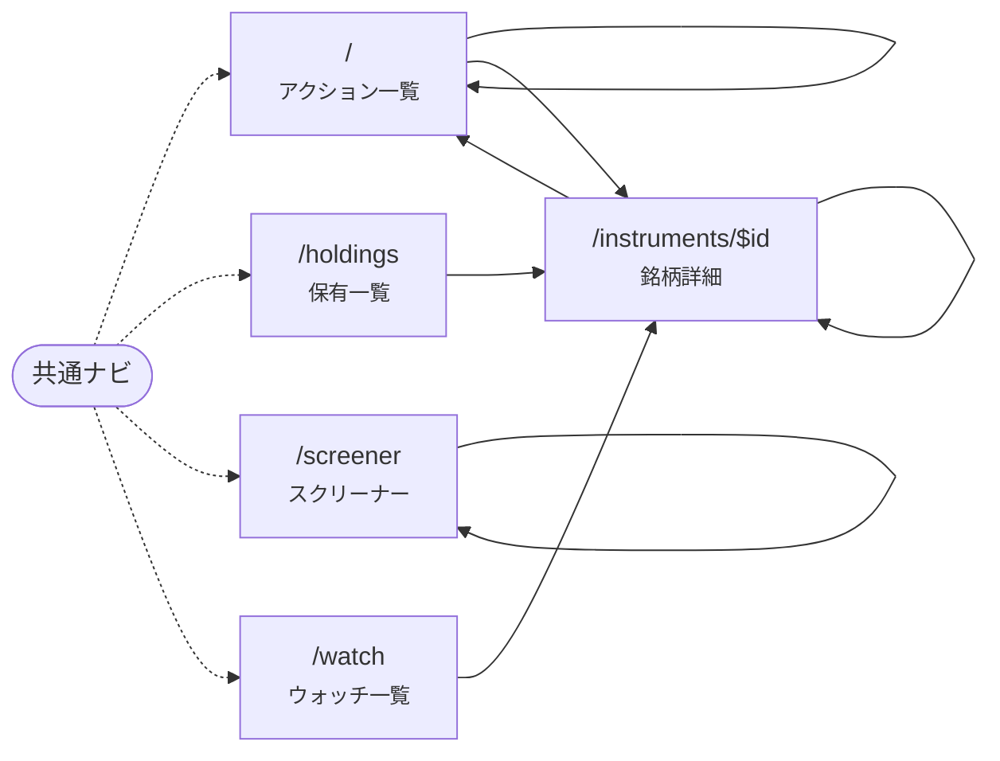

# 画面遷移図（現在）

**このファイルは自動生成。手で編集しない。** 生成元は `apps/dashboard/src/routes/` と各画面から辿れる `<Link to>`、生成コマンドは `pnpm screens`。
古くなっていると `pnpm test` が落ちる。画面の目的とユーザーフローは Design Doc（0005 §3.5 など）を参照。

| パス | 画面 | ルート | ページのスライス |
| --- | --- | --- | --- |
| `/` | アクション一覧。未対応 / 対応した / 見送り をタブで切り替え、対応した・見送りにできる。株価が古ければ警告 | `routes/index.tsx` | `pages/actions` |
| `/holdings` | 保有一覧。最新スナップショットの銘柄ごとに数量・取得単価・最新株価・前日比・取得単価比・損益 | `routes/holdings.tsx` | `pages/holdings` |
| `/instruments/$id` | 銘柄詳細。スコアと内訳、口座別の保有、アクションとシグナルの履歴、適時開示とニュース（判定つき）、直近 30 件の株価 | `routes/instruments.$id.tsx` | `pages/instrument` |
| `/screener` | スクリーナー。CLI（pnpm screen run）の実行結果を見て、候補をウォッチに追加する。実行は画面からは行わない | `routes/screener.tsx` | `pages/screener` |
| `/watch` | ウォッチ一覧。まだ持っていないが監視している銘柄の株価の位置・スコア・未対応アクション。外す操作 | `routes/watch.tsx` | `pages/watch` |

共通ナビ（すべての画面のヘッダ）: `/`, `/holdings`, `/screener`, `/watch`

矢印は「その画面のコードから到達できる `<Link>`」。静的解析なので表示条件（props で出し分ける等）は見ない。自分自身への矢印はタブなど、同じ画面のまま条件が変わる遷移。

