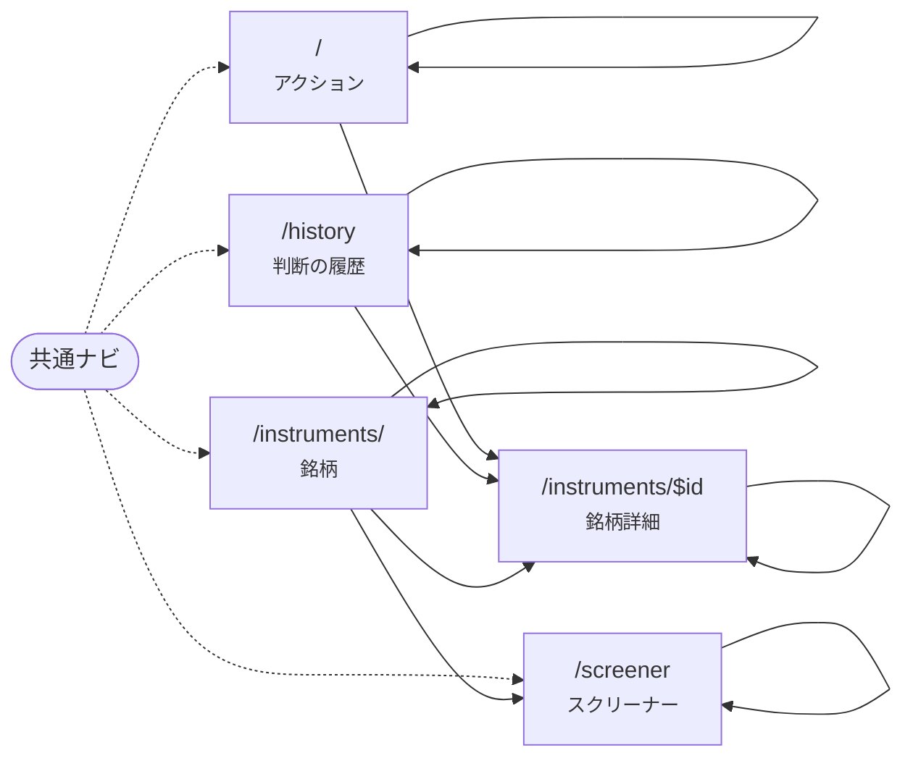

# 画面遷移図（現在）

**このファイルは自動生成。手で編集しない。** 生成元は `apps/dashboard/src/routes/` と各画面から辿れる `<Link to>`、生成コマンドは `pnpm screens`。
古くなっていると `pnpm test` が落ちる。画面の目的とユーザーフローは Design Doc（0005 §3.5 など）を参照。

| パス | 画面 | ルート | ページのスライス |
| --- | --- | --- | --- |
| `/` | アクション。毎朝の入口。状態の帯 → 未対応 / 対応した / 見送り のタブ → 銘柄ごとのカード（検知 + 助言、まとめて対応）→ スコアの大きな変動 | `routes/index.tsx` | `pages/actions` |
| `/history` | 判断の履歴。対応した / 見送りにしたアクションと、判断時の株価とその後の変化。stance × 判断の集計 | `routes/history.tsx` | `pages/history` |
| `/instruments/` | 銘柄。監視している銘柄の一覧を 保有 / ウォッチ のタブで切り替える。ウォッチはスクリーナーから追加できる | `routes/instruments.index.tsx` | `pages/instruments` |
| `/instruments/$id` | 銘柄詳細。ヘッダ帯（株価・スコア・折れ線）で「今どうか」、タブで 概要 / タイムライン / ニュース・開示 / 財務・指標 / 株価 | `routes/instruments.$id.tsx` | `pages/instrument` |
| `/screener` | スクリーナー。CLI（pnpm screen run）の実行結果を見て、候補をウォッチに追加する。実行は画面からは行わない | `routes/screener.tsx` | `pages/screener` |

共通ナビ（すべての画面のサイドバー）: `/`, `/history`, `/instruments`, `/screener`

矢印は「その画面のコードから到達できる `<Link>`」。静的解析なので表示条件（props で出し分ける等）は見ない。自分自身への矢印はタブなど、同じ画面のまま条件が変わる遷移。

